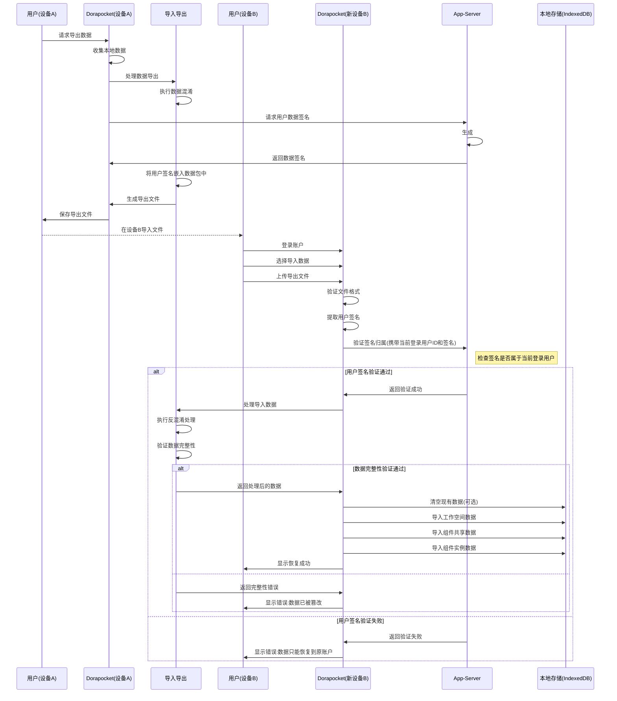

```mermaid
sequenceDiagram
    participant UserOld as 用户(设备A)
    participant AppOld as Dorapocket(设备A)
    participant Security as 导入导出
    participant UserNew as 用户(设备B)
    participant AppNew as Dorapocket(新设备B)
    participant AppServer as App-Server
    participant LocalDB as 本地存储(IndexedDB)
    
    %% 导出流程
    UserOld->>AppOld: 请求导出数据
    AppOld->>AppOld: 收集本地数据
    
    AppOld->>Security: 处理数据导出
    Security->>Security: 执行数据混淆
    
    %% 获取用户签名
    AppOld->>AppServer: 请求用户数据签名
    AppServer->>AppServer: 生成
    AppServer->>AppOld: 返回数据签名
    
    Security->>Security: 将用户签名嵌入数据包中
    Security->>AppOld: 生成导出文件
    AppOld->>UserOld: 保存导出文件
    
    %% 传输文件(由用户完成)
    UserOld-->>UserNew: 在设备B导入文件
    
    %% 恢复流程
    UserNew->>AppNew: 登录账户
    UserNew->>AppNew: 选择导入数据
    UserNew->>AppNew: 上传导出文件
    
    AppNew->>AppNew: 验证文件格式
    AppNew->>AppNew: 提取用户签名
    
    %% 验证用户签名
    AppNew->>AppServer: 验证签名归属(携带当前登录用户ID和签名)
    note right of AppServer: 检查签名是否属于当前登录用户
    
    alt 用户签名验证通过
        AppServer->>AppNew: 返回验证成功
        
        AppNew->>Security: 处理导入数据
        Security->>Security: 执行反混淆处理
        Security->>Security: 验证数据完整性
        
        alt 数据完整性验证通过
            Security->>AppNew: 返回处理后的数据
            AppNew->>LocalDB: 清空现有数据(可选)
            AppNew->>LocalDB: 导入工作空间数据
            AppNew->>LocalDB: 导入组件共享数据
            AppNew->>LocalDB: 导入组件实例数据
            AppNew->>UserNew: 显示恢复成功
        else
            Security->>AppNew: 返回完整性错误
            AppNew->>UserNew: 显示错误:数据已被篡改
        end
    else 用户签名验证失败
        AppServer->>AppNew: 返回验证失败
        AppNew->>UserNew: 显示错误:数据只能恢复到原账户
    end
```