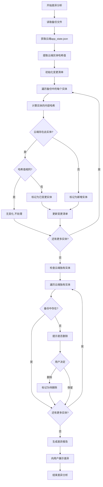

```mermaid
flowchart TD
    Start[开始差异分析] --> ReadBackup[读取备份文件]
    ReadBackup --> GetAppState[获取云端app_state.json]
    GetAppState --> ExtractHashes[提取云端实体哈希值]
    ExtractHashes --> InitChangelist[初始化变更清单]
    
    InitChangelist --> ForEachEntity[遍历备份中的每个实体]
    ForEachEntity --> ComputeHash[计算实体的内容哈希]
    ComputeHash --> HashExists{云端存在此实体?}
    
    HashExists -- 是 --> CompareHash{哈希值相同?}
    HashExists -- 否 --> MarkAsNew[标记为新增实体]
    
    CompareHash -- 是 --> NoChange[无变化,不处理]
    CompareHash -- 否 --> MarkAsChanged[标记为已变更实体]
    
    MarkAsNew --> UpdateChangelist[更新变更清单]
    MarkAsChanged --> UpdateChangelist
    NoChange --> NextEntity{还有更多实体?}
    
    UpdateChangelist --> NextEntity
    NextEntity -- 是 --> ForEachEntity
    NextEntity -- 否 --> CheckCloudOnly[检查云端独有实体]
    
    CheckCloudOnly --> ForEachCloudEntity[遍历云端独有实体]
    ForEachCloudEntity --> ExistsInBackup{备份中存在?}
    
    ExistsInBackup -- 是 --> CloudNextEntity{还有更多实体?}
    ExistsInBackup -- 否 --> PromptDelete[提示是否删除]
    
    PromptDelete --> UserDecide{用户决定}
    UserDecide -- 删除 --> MarkAsDeleted[标记为待删除]
    UserDecide -- 保留 --> CloudNextEntity
    
    MarkAsDeleted --> CloudNextEntity
    CloudNextEntity -- 是 --> ForEachCloudEntity
    CloudNextEntity -- 否 --> GenerateReport[生成差异报告]
    
    GenerateReport --> ShowToUser[向用户展示差异]
    ShowToUser --> End[结束差异分析]
```