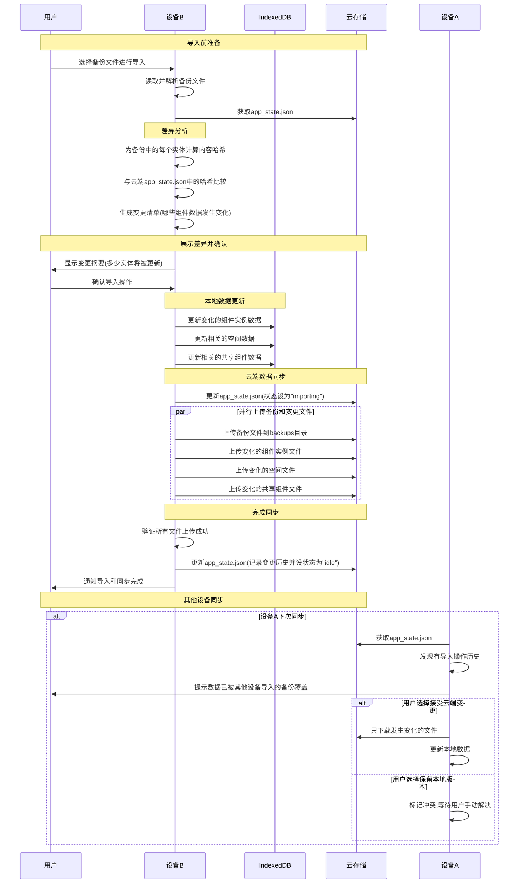

```mermaid
sequenceDiagram
    participant 用户
    participant 设备B
    participant IndexedDB
    participant 云存储
    
    Note over 用户, 云存储: 导入前准备
    用户->>设备B: 选择备份文件进行导入
    设备B->>设备B: 读取并解析备份文件
    设备B->>云存储: 获取app_state.json
    
    Note over 设备B: 差异分析
    设备B->>设备B: 为备份中的每个实体计算内容哈希
    设备B->>设备B: 与云端app_state.json中的哈希比较
    设备B->>设备B: 生成变更清单(哪些组件数据发生变化)
    
    Note over 用户, 云存储: 展示差异并确认
    设备B->>用户: 显示变更摘要(多少实体将被更新)
    用户->>设备B: 确认导入操作
    
    Note over 设备B, IndexedDB: 本地数据更新
    设备B->>IndexedDB: 更新变化的组件实例数据
    设备B->>IndexedDB: 更新相关的空间数据
    设备B->>IndexedDB: 更新相关的共享组件数据
    
    Note over 设备B, 云存储: 云端数据同步
    设备B->>云存储: 更新app_state.json(状态设为"importing")
    par 并行上传备份和变更文件
        设备B->>云存储: 上传备份文件到backups目录
        设备B->>云存储: 上传变化的组件实例文件
        设备B->>云存储: 上传变化的空间文件
        设备B->>云存储: 上传变化的共享组件文件
    end
    
    Note over 设备B, 云存储: 完成同步
    设备B->>设备B: 验证所有文件上传成功
    设备B->>云存储: 更新app_state.json(记录变更历史并设状态为"idle")
    设备B->>用户: 通知导入和同步完成
    
    Note over 用户, 云存储: 其他设备同步
    alt 设备A下次同步
        设备A->>云存储: 获取app_state.json
        设备A->>设备A: 发现有导入操作历史
        设备A->>用户: 提示数据已被其他设备导入的备份覆盖
        alt 用户选择接受云端变更
            设备A->>云存储: 只下载发生变化的文件
            设备A->>设备A: 更新本地数据
        else 用户选择保留本地版本
            设备A->>设备A: 标记冲突,等待用户手动解决
        end
    end
```