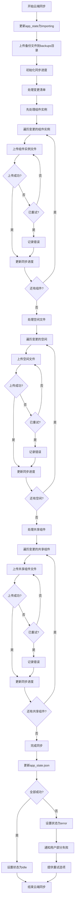

```mermaid
flowchart TD
    Start[开始云端同步] --> UpdateStatus[更新app_state为importing]
    UpdateStatus --> BackupUpload[上传备份文件到backups目录]
    BackupUpload --> InitSync[初始化同步进度]
    
    InitSync --> ProcessChanges[处理变更清单]
    ProcessChanges --> ComponentsFirst[先处理组件实例]
    ComponentsFirst --> ForEachComponent[遍历变更的组件实例]
    
    ForEachComponent --> UploadComponent[上传组件实例文件]
    UploadComponent --> ComponentSuccess{上传成功?}
    
    ComponentSuccess -- 是 --> UpdateProgress[更新同步进度]
    ComponentSuccess -- 否 --> RetryComponent{已重试?}
    RetryComponent -- 是 --> LogError[记录错误]
    RetryComponent -- 否 --> UploadComponent
    
    LogError --> UpdateProgress
    UpdateProgress --> NextComponent{还有组件?}
    NextComponent -- 是 --> ForEachComponent
    NextComponent -- 否 --> SpacesNext[处理空间文件]
    
    SpacesNext --> ForEachSpace[遍历变更的空间]
    ForEachSpace --> UploadSpace[上传空间文件]
    UploadSpace --> SpaceSuccess{上传成功?}
    
    SpaceSuccess -- 是 --> UpdateSpaceProgress[更新同步进度]
    SpaceSuccess -- 否 --> RetrySpace{已重试?}
    RetrySpace -- 是 --> LogSpaceError[记录错误]
    RetrySpace -- 否 --> UploadSpace
    
    LogSpaceError --> UpdateSpaceProgress
    UpdateSpaceProgress --> NextSpace{还有空间?}
    NextSpace -- 是 --> ForEachSpace
    NextSpace -- 否 --> SharedNext[处理共享组件]
    
    SharedNext --> ForEachShared[遍历变更的共享组件]
    ForEachShared --> UploadShared[上传共享组件文件]
    UploadShared --> SharedSuccess{上传成功?}
    
    SharedSuccess -- 是 --> UpdateSharedProgress[更新同步进度]
    SharedSuccess -- 否 --> RetryShared{已重试?}
    RetryShared -- 是 --> LogSharedError[记录错误]
    RetryShared -- 否 --> UploadShared
    
    LogSharedError --> UpdateSharedProgress
    UpdateSharedProgress --> NextShared{还有共享组件?}
    NextShared -- 是 --> ForEachShared
    NextShared -- 否 --> FinalizeSync[完成同步]
    
    FinalizeSync --> UpdateAppState[更新app_state.json]
    UpdateAppState --> CheckAllSuccess{全部成功?}
    
    CheckAllSuccess -- 是 --> SetStatusIdle[设置状态为idle]
    CheckAllSuccess -- 否 --> SetStatusError[设置状态为error]
    
    SetStatusIdle --> End[结束云端同步]
    SetStatusError --> NotifyUser[通知用户部分失败]
    NotifyUser --> OfferRetry[提供重试选项]
    OfferRetry --> End
```