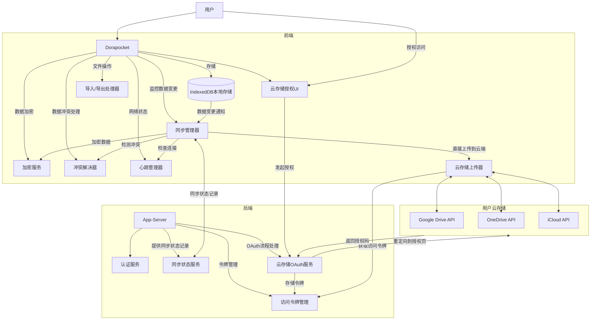

```mermaid
flowchart TD
    User[用户] --> FrontEnd[Dorapocket]
    
    subgraph 前端
        FrontEnd --> |存储| LocalDB[(IndexedDB本地存储)]
        FrontEnd --> |监控数据变更| SyncManager[同步管理器]
        FrontEnd --> CloudAuthUI[云存储授权UI]
        FrontEnd --> |数据加密| CryptoService[加密服务]
        FrontEnd --> |数据冲突处理| ConflictResolver[冲突解决器]
        FrontEnd -->|网络状态| HeartbeatMonitor[心跳管理器]
        FrontEnd --> |文件操作| ImportExportHandler[导入/导出处理器]
        
        SyncManager --> |加密数据| CryptoService
        SyncManager --> |检测冲突| ConflictResolver
        SyncManager --> |检查连接| HeartbeatMonitor
        SyncManager --> |直接上传到云端| CloudUploader[云存储上传器]
        LocalDB -- "数据变更通知" --> SyncManager
    end
    
    subgraph 后端
        AppServer[App-Server] --> AuthService[认证服务]
        AppServer --> |提供同步状态记录| SyncStatusService[同步状态服务]
        AppServer --> |OAuth流程处理| CloudOAuthService[云存储OAuth服务]
        AppServer --> |令牌管理| TokenManager[访问令牌管理]
    end
    
    subgraph 用户云存储
        CloudUploader <--> GoogleDrive[Google Drive API]
        CloudUploader <--> OneDrive[OneDrive API]
        CloudUploader <--> iCloud[iCloud API]
    end
    
    User -- "授权访问" --> CloudAuthUI
    CloudAuthUI -- "发起授权" --> CloudOAuthService
    CloudOAuthService -- "重定向到授权页" --> 用户云存储
    用户云存储 -- "返回授权码" --> CloudOAuthService
    CloudOAuthService -- "存储令牌" --> TokenManager
    CloudUploader -- "获取访问令牌" --> TokenManager
    SyncManager <--> |同步状态记录| SyncStatusService
```