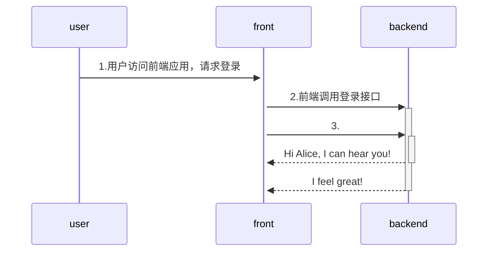

```mermaid
sequenceDiagram
    user->>+front: 1.用户访问前端应用，请求登录
    front->>+backend: 2.前端调用登录接口
    front->>+backend: 3.
    backend-->>-front: Hi Alice, I can hear you!
    backend-->>-front: I feel great!
            
```