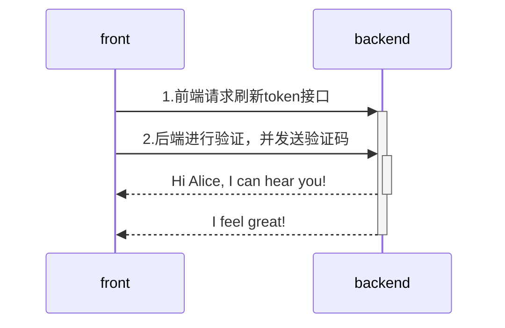

```mermaid
sequenceDiagram
    front->>+backend: 1.前端请求刷新token接口
    front->>+backend: 2.后端进行验证，并发送验证码
    backend-->>-front: Hi Alice, I can hear you!
    backend-->>-front: I feel great!
            
```