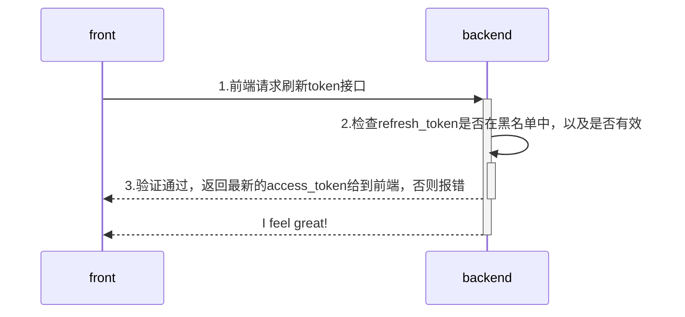

```mermaid
sequenceDiagram
    front->>+backend: 1.前端请求刷新token接口
    backend->>+backend: 2.检查refresh_token是否在黑名单中，以及是否有效
    backend-->>-front: 3.验证通过，返回最新的access_token给到前端，否则报错
    backend-->>-front: I feel great!
            
```