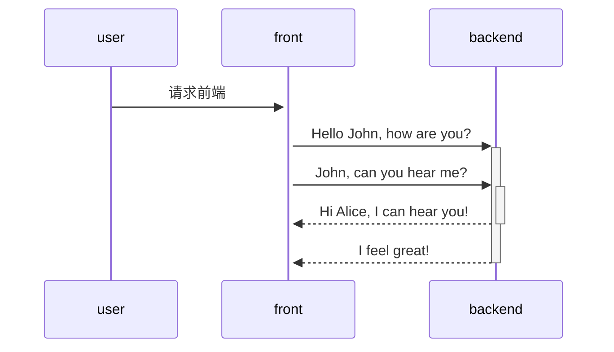

```mermaid
sequenceDiagram
    user->>+front: 请求前端
    front->>+backend: Hello John, how are you?
    front->>+backend: John, can you hear me?
    backend-->>-front: Hi Alice, I can hear you!
    backend-->>-front: I feel great!
            
```