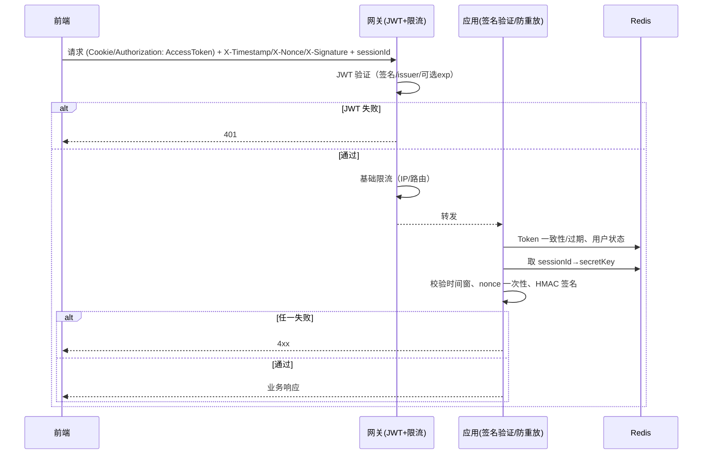

```mermaid
sequenceDiagram
    participant FE as 前端
    participant Kong as 网关(JWT+限流)
    participant App as 应用(签名验证/防重放)
    participant Redis as Redis

    FE->>Kong: 请求 (Cookie/Authorization: AccessToken) + X-Timestamp/X-Nonce/X-Signature + sessionId
    Kong->>Kong: JWT 验证（签名/issuer/可选exp）
    alt JWT 失败
      Kong-->>FE: 401
    else 通过
      Kong->>Kong: 基础限流（IP/路由）
      Kong-->>App: 转发
      App->>Redis: Token 一致性/过期、用户状态
      App->>Redis: 取 sessionId→secretKey
      App->>App: 校验时间窗、nonce 一次性、HMAC 签名
      alt 任一失败
        App-->>FE: 4xx
      else 通过
        App-->>FE: 业务响应
      end
    end
```