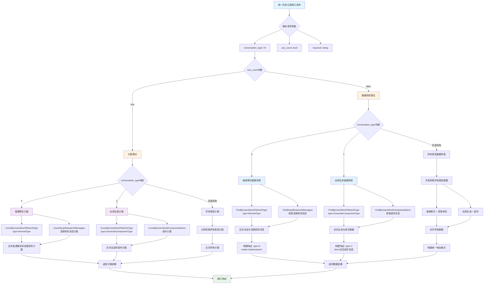

```mermaid
flowchart TD
    A[统一历史记录接口请求] --> B{解析请求参数}
    B --> C[conversation_type: int]
    B --> D[use_count: bool]
    B --> E[keyword: string]
    
    C --> F{use_count判断}
    
    F -->|true| G[计数模式]
    F -->|false| H[数据获取模式]
    
    G --> I{conversation_type判断}
    I -->|0| J[普通聊天计数]
    I -->|1| K[应用生成计数]
    I -->|空或其他| L[所有类型计数]
    
    J --> J1[CountByUserIdAndTitleAndType<br/>type=NormalType]
    J --> J2[CountDeepResearchMessages<br/>深度研究消息计数]
    J1 --> J3[合并普通聊天和深度研究计数]
    J2 --> J3
    J3 --> M[返回计数结果]
    
    K --> K1[CountByUserIdAndTitleAndType<br/>type=GenerateComponentType]
    K --> K2[CountByUserIdAndComponentName<br/>组件计数]
    K1 --> K3[合并会话和组件计数]
    K2 --> K3
    K3 --> M
    
    L --> L1[分别获取所有类型计数]
    L1 --> L2[合并所有计数]
    L2 --> M
    
    H --> N{conversation_type判断}
    N -->|0| O[普通聊天数据获取]
    N -->|1| P[应用生成数据获取]
    N -->|空或其他| Q[所有类型数据获取]
    
    O --> O1[FindByUserIdAndTitleAndType<br/>type=NormalType]
    O --> O2[FindDeepResearchMessages<br/>获取深度研究消息]
    O1 --> O3[合并会话与深度研究消息]
    O2 --> O3
    O3 --> O4[构建响应: type=0<br/>mode=chat/research]
    O4 --> R[返回数据结果]
    
    P --> P1[FindByUserIdAndTitleAndType<br/>type=GenerateComponentType]
    P --> P2[FindByUserIdAndComponentName<br/>获取组件信息]
    P1 --> P3[合并会话与组件数据]
    P2 --> P3
    P3 --> P4[构建响应: type=1<br/>items包含组件信息]
    P4 --> R
    
    Q --> Q1[并发获取所有类型数据]
    Q1 --> Q2[普通聊天 + 深度研究]
    Q1 --> Q3[应用生成 + 组件]
    Q2 --> Q4[合并所有数据]
    Q3 --> Q4
    Q4 --> Q5[构建统一响应格式]
    Q5 --> R
    
    M --> S[接口响应]
    R --> S
    
    style A fill:#e1f5fe
    style S fill:#e8f5e8
    style G fill:#fff3e0
    style H fill:#fff3e0
    style J fill:#f3e5f5
    style K fill:#f3e5f5
    style O fill:#e3f2fd
    style P fill:#e3f2fd
```