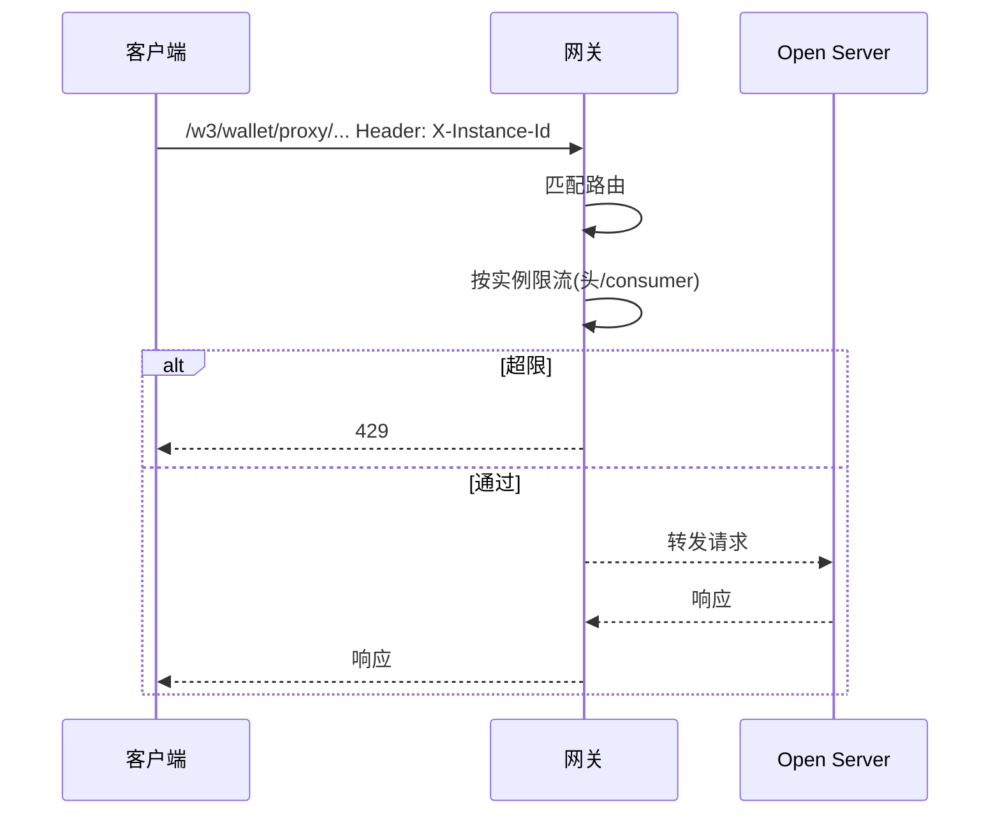

```mermaid
sequenceDiagram
    participant Client as 客户端
    participant Kong as 网关
    participant Open as Open Server

    Client->>Kong: /w3/wallet/proxy/...  Header: X-Instance-Id
    Kong->>Kong: 匹配路由
    Kong->>Kong: 按实例限流(头/consumer)
    alt 超限
      Kong-->>Client: 429
    else 通过
      Kong-->>Open: 转发请求
      Open-->>Kong: 响应
      Kong-->>Client: 响应
    end
```