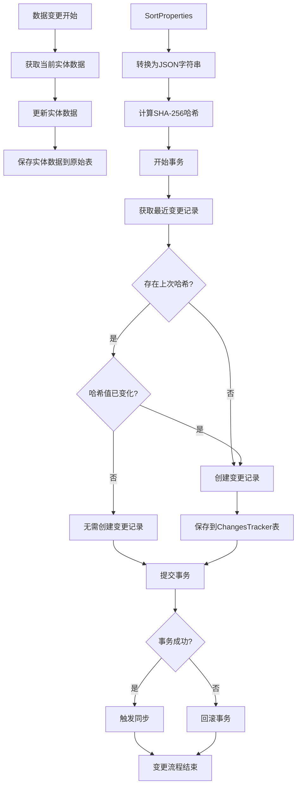

```mermaid
flowchart TD
    Start[数据变更开始] --> GetEntity[获取当前实体数据]
    GetEntity --> UpdateData[更新实体数据]
    UpdateData --> SaveEntity[保存实体数据到原始表]
    
    SortProperties --> ConvertToJson[转换为JSON字符串]
    ConvertToJson --> ComputeSHA256[计算SHA-256哈希]
    
    ComputeSHA256 --> BeginTx[开始事务]
    BeginTx --> GetLastChange[获取最近变更记录]
    
    GetLastChange --> HashExists{存在上次哈希?}
    HashExists -- 是 --> CompareHash{哈希值已变化?}
    HashExists -- 否 --> CreateChange[创建变更记录]
    
    CompareHash -- 是 --> CreateChange
    CompareHash -- 否 --> NoChangeNeeded[无需创建变更记录]
    
    CreateChange --> SaveChange[保存到ChangesTracker表]
    NoChangeNeeded --> CommitTx[提交事务]
    
    SaveChange --> CommitTx
    CommitTx --> Success{事务成功?}
    Success -- 是 --> TriggerSync[触发同步]
    Success -- 否 --> RollbackTx[回滚事务]
    
    TriggerSync --> End[变更流程结束]
    RollbackTx --> End
```