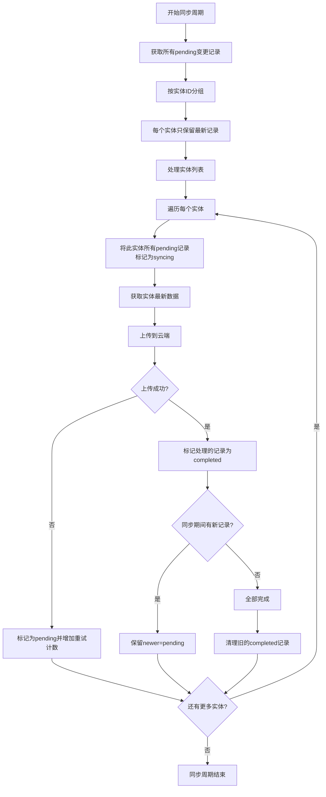

```mermaid
flowchart TD
    Start[开始同步周期] --> FetchChanges[获取所有pending变更记录]
    FetchChanges --> GroupByEntity[按实体ID分组]
    GroupByEntity --> FilterLatest[每个实体只保留最新记录]
    
    FilterLatest --> ProcessEntities[处理实体列表]
    ProcessEntities --> ForEachEntity[遍历每个实体]
    
    ForEachEntity --> MarkSyncing[将此实体所有pending记录标记为syncing]
    MarkSyncing --> GetEntityData[获取实体最新数据]
    GetEntityData --> UploadToCloud[上传到云端]
    
    UploadToCloud --> Success{上传成功?}
    Success -- 否 --> MarkFailed[标记为pending并增加重试计数]
    Success -- 是 --> MarkCompleted[标记处理的记录为completed]
    
    MarkCompleted --> CheckNew{同步期间有新记录?}
    CheckNew -- 是 --> KeepNewer[保留newer=pending]
    CheckNew -- 否 --> NoNewRecords[全部完成]
    
    KeepNewer --> NextEntity{还有更多实体?}
    NoNewRecords --> CleanupOld[清理旧的completed记录]
    
    MarkFailed --> NextEntity
    CleanupOld --> NextEntity
    
    NextEntity -- 是 --> ForEachEntity
    NextEntity -- 否 --> End[同步周期结束]
```