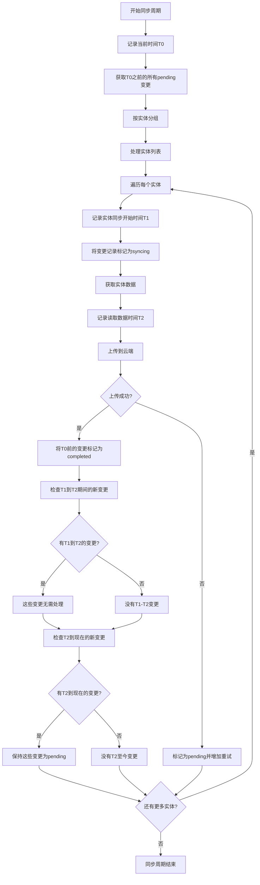

```mermaid
flowchart TD
    Start[开始同步周期] --> RecordT0[记录当前时间T0]
    RecordT0 --> FetchChanges[获取T0之前的所有pending变更]
    FetchChanges --> GroupByEntity[按实体分组]
    
    GroupByEntity --> ProcessEntities[处理实体列表]
    ProcessEntities --> ForEachEntity[遍历每个实体]
    
    ForEachEntity --> RecordT1[记录实体同步开始时间T1]
    RecordT1 --> MarkSyncing[将变更记录标记为syncing]
    MarkSyncing --> GetEntityData[获取实体数据]
    GetEntityData --> RecordT2[记录读取数据时间T2]
    
    RecordT2 --> UploadToCloud[上传到云端]
    UploadToCloud --> Success{上传成功?}
    
    Success -- 否 --> MarkFailed[标记为pending并增加重试]
    Success -- 是 --> MarkT0ChangesCompleted[将T0前的变更标记为completed]
    
    MarkT0ChangesCompleted --> CheckT1ToT2[检查T1到T2期间的新变更]
    CheckT1ToT2 --> T1T2Changes{有T1到T2的变更?}
    
    T1T2Changes -- 是 --> MarkUnchanged[这些变更无需处理]
    T1T2Changes -- 否 --> NoT1T2Changes[没有T1-T2变更]
    
    MarkUnchanged --> CheckT2ToNow[检查T2到现在的新变更]
    NoT1T2Changes --> CheckT2ToNow
    
    CheckT2ToNow --> T2NowChanges{有T2到现在的变更?}
    T2NowChanges -- 是 --> KeepPending[保持这些变更为pending]
    T2NowChanges -- 否 --> NoT2NowChanges[没有T2至今变更]
    
    KeepPending --> NextEntity{还有更多实体?}
    NoT2NowChanges --> NextEntity
    
    MarkFailed --> NextEntity
    NextEntity -- 是 --> ForEachEntity
    NextEntity -- 否 --> End[同步周期结束]
```