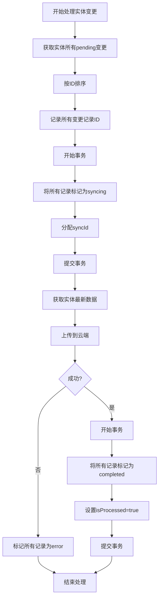

```mermaid
flowchart TD
    Start[开始处理实体变更] --> GetChanges[获取实体所有pending变更]
    GetChanges --> OrderById[按ID排序]
    OrderById --> RecordIds[记录所有变更记录ID]
    
    RecordIds --> BeginTx[开始事务]
    BeginTx --> MarkSyncing[将所有记录标记为syncing]
    MarkSyncing --> AssignSyncId[分配syncId]
    AssignSyncId --> CommitTx[提交事务]
    
    CommitTx --> GetEntity[获取实体最新数据]
    GetEntity --> UploadToCloud[上传到云端]
    UploadToCloud --> Success{成功?}
    
    Success -- 是 --> BeginTx2[开始事务]
    Success -- 否 --> MarkError[标记所有记录为error]
    
    BeginTx2 --> MarkCompleted[将所有记录标记为completed]
    MarkCompleted --> SetProcessed[设置isProcessed=true]
    SetProcessed --> CommitTx2[提交事务]
    
    MarkError --> End[结束处理]
    CommitTx2 --> End
```