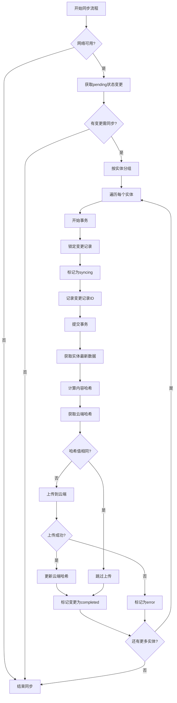

```mermaid
flowchart TD
    Start[开始同步流程] --> CheckNetwork{网络可用?}
    CheckNetwork -- 否 --> End[结束同步]
    CheckNetwork -- 是 --> FetchChanges[获取pending状态变更]
    
    FetchChanges --> HasChanges{有变更需同步?}
    HasChanges -- 否 --> End
    HasChanges -- 是 --> GroupByEntity[按实体分组]
    
    GroupByEntity --> ForEachEntity[遍历每个实体]
    ForEachEntity --> BeginTx[开始事务]
    BeginTx --> LockChanges[锁定变更记录]
    
    LockChanges --> MarkSyncing[标记为syncing]
    MarkSyncing --> RecordIds[记录变更记录ID]
    RecordIds --> CommitTx[提交事务]
    
    CommitTx --> FetchEntityData[获取实体最新数据]
    FetchEntityData --> ComputeHash[计算内容哈希]
    
    ComputeHash --> GetCloudHash[获取云端哈希]
    GetCloudHash --> HashEqual{哈希值相同?}
    
    HashEqual -- 是 --> SkipUpload[跳过上传]
    HashEqual -- 否 --> UploadToCloud[上传到云端]
    
    UploadToCloud --> Success{上传成功?}
    Success -- 否 --> MarkError[标记为error]
    Success -- 是 --> UpdateCloudHash[更新云端哈希]
    
    UpdateCloudHash --> MarkCompleted[标记变更为completed]
    SkipUpload --> MarkCompleted
    
    MarkCompleted --> NextEntity{还有更多实体?}
    MarkError --> NextEntity
    
    NextEntity -- 是 --> ForEachEntity
    NextEntity -- 否 --> End
```