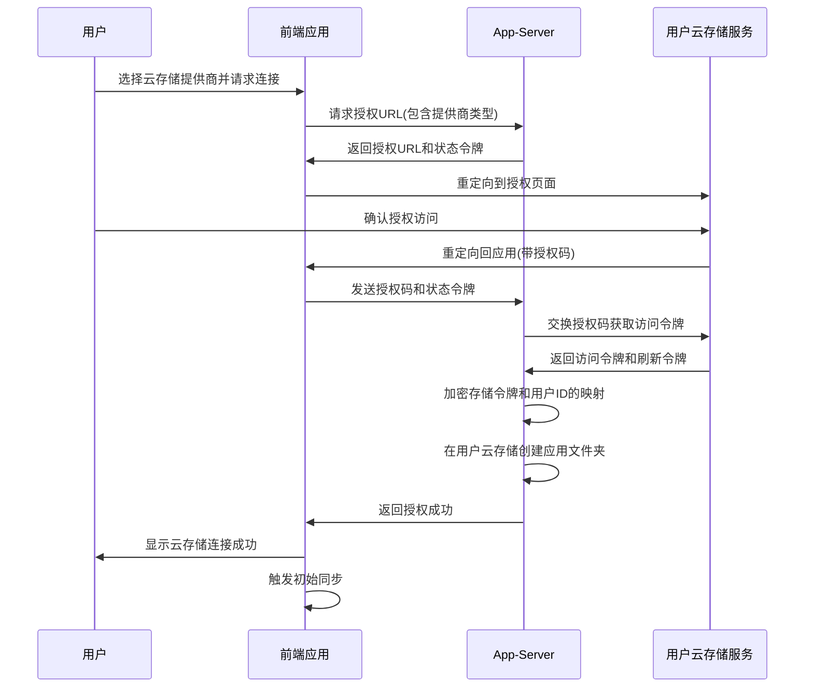

```mermaid

sequenceDiagram
    participant User as 用户
    participant Frontend as 前端应用
    participant AppServer as App-Server
    participant CloudProvider as 用户云存储服务
    
    User->>Frontend: 选择云存储提供商并请求连接
    Frontend->>AppServer: 请求授权URL(包含提供商类型)

    AppServer->>Frontend: 返回授权URL和状态令牌
    Frontend->>CloudProvider: 重定向到授权页面
    User->>CloudProvider: 确认授权访问
    CloudProvider->>Frontend: 重定向回应用(带授权码)
    Frontend->>AppServer: 发送授权码和状态令牌
    AppServer->>CloudProvider: 交换授权码获取访问令牌
    CloudProvider->>AppServer: 返回访问令牌和刷新令牌
    
    AppServer->>AppServer: 加密存储令牌和用户ID的映射
    AppServer->>AppServer: 在用户云存储创建应用文件夹
    AppServer->>Frontend: 返回授权成功
    
    Frontend->>User: 显示云存储连接成功
    Frontend->>Frontend: 触发初始同步

```