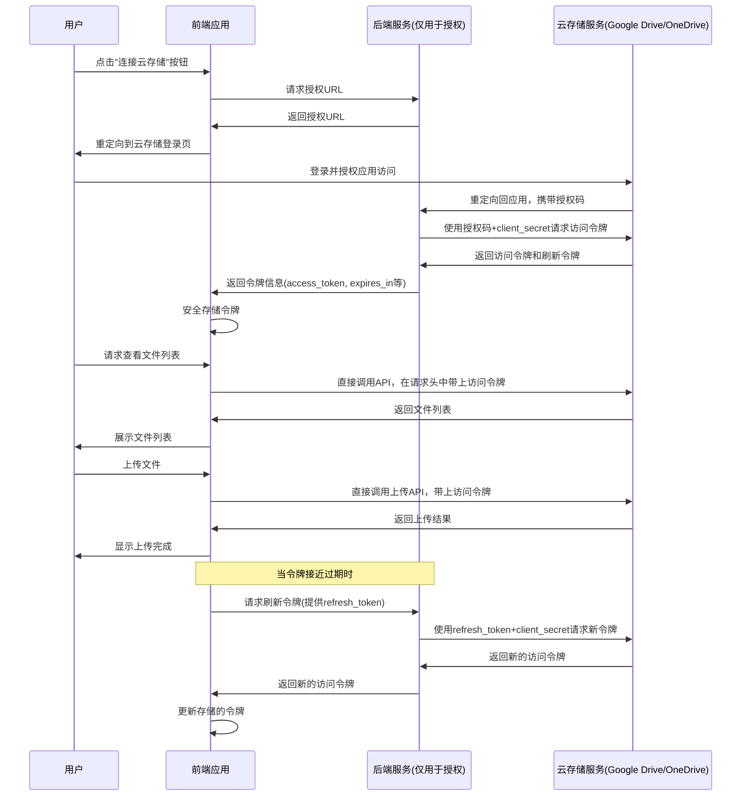

```mermaid

sequenceDiagram
    participant 用户
    participant 前端 as 前端应用
    participant 后端 as 后端服务(仅用于授权)
    participant 云存储 as 云存储服务(Google Drive/OneDrive)


    %% 授权阶段 - 需要后端配合
    用户->>前端: 点击"连接云存储"按钮
    前端->>后端: 请求授权URL
    后端->>前端: 返回授权URL
    前端->>用户: 重定向到云存储登录页
    用户->>云存储: 登录并授权应用访问
    云存储->>后端: 重定向回应用，携带授权码
    后端->>云存储: 使用授权码+client_secret请求访问令牌
    云存储->>后端: 返回访问令牌和刷新令牌
    后端->>前端: 返回令牌信息(access_token, expires_in等)
    前端->>前端: 安全存储令牌

    %% 使用阶段 - 前端直接调用云存储API
    用户->>前端: 请求查看文件列表
    前端->>云存储: 直接调用API，在请求头中带上访问令牌
    云存储->>前端: 返回文件列表
    前端->>用户: 展示文件列表

    %% 上传文件
    用户->>前端: 上传文件
    前端->>云存储: 直接调用上传API，带上访问令牌
    云存储->>前端: 返回上传结果
    前端->>用户: 显示上传完成

    %% 令牌刷新 - 仍需后端配合
    note over 前端,后端: 当令牌接近过期时
    前端->>后端: 请求刷新令牌(提供refresh_token)
    后端->>云存储: 使用refresh_token+client_secret请求新令牌
    云存储->>后端: 返回新的访问令牌
    后端->>前端: 返回新的访问令牌
    前端->>前端: 更新存储的令牌

```