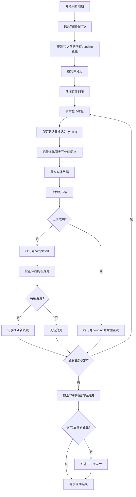

```mermaid
flowchart TD
    Start[开始同步周期] --> RecordTime[记录当前时间T0]
    RecordTime --> FetchChanges[获取T0之前的所有pending变更]
    FetchChanges --> GroupByEntity[按实体分组]
    
    GroupByEntity --> ProcessEntities[处理实体列表]
    ProcessEntities --> ForEachEntity[遍历每个实体]
    
    ForEachEntity --> MarkSyncing[将变更记录标记为syncing]
    MarkSyncing --> RecordEntityTime[记录实体同步开始时间Te]
    RecordEntityTime --> GetEntityData[获取实体数据]
    GetEntityData --> UploadToCloud[上传到云端]
    
    UploadToCloud --> Success{上传成功?}
    Success -- 否 --> MarkFailed[标记为pending并增加重试]
    Success -- 是 --> MarkCompleted[标记为completed]
    
    MarkCompleted --> CheckNewChanges[检查Te后的新变更]
    CheckNewChanges --> HasNewChanges{有新变更?}
    
    HasNewChanges -- 是 --> LogNewChanges[记录找到新变更]
    HasNewChanges -- 否 --> NoNewChanges[无新变更]
    
    LogNewChanges --> NextEntity{还有更多实体?}
    NoNewChanges --> NextEntity
    
    MarkFailed --> NextEntity
    NextEntity -- 是 --> ForEachEntity
    NextEntity -- 否 --> CheckT0ToNow[检查T0到现在的新变更]
    
    CheckT0ToNow --> FinalCheck{有T0后的新变更?}
    FinalCheck -- 是 --> ScheduleNextSync[安排下一次同步]
    FinalCheck -- 否 --> End[同步周期结束]
    ScheduleNextSync --> End
```