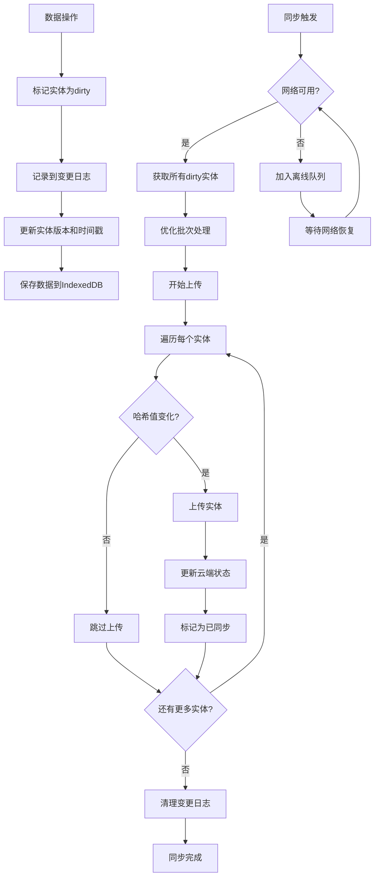

```mermaid
flowchart TD
    Start[数据操作] --> MarkDirty[标记实体为dirty]
    MarkDirty --> RecordToJournal[记录到变更日志]
    RecordToJournal --> UpdateEntity[更新实体版本和时间戳]
    UpdateEntity --> SaveData[保存数据到IndexedDB]
    
    SyncTrigger[同步触发] --> CheckNetwork{网络可用?}
    CheckNetwork -- 否 --> QueueForLater[加入离线队列]
    CheckNetwork -- 是 --> FetchDirty[获取所有dirty实体]
    
    FetchDirty --> OptimizeBatch[优化批次处理]
    OptimizeBatch --> StartUpload[开始上传]
    StartUpload --> ForEachEntity[遍历每个实体]
    ForEachEntity --> HashChanged{哈希值变化?}
    
    HashChanged -- 否 --> SkipUpload[跳过上传]
    HashChanged -- 是 --> UploadEntity[上传实体]
    UploadEntity --> UpdateCloudState[更新云端状态]
    UpdateCloudState --> MarkSynced[标记为已同步]
    
    SkipUpload --> NextEntity{还有更多实体?}
    MarkSynced --> NextEntity
    NextEntity -- 是 --> ForEachEntity
    NextEntity -- 否 --> CleanupJournal[清理变更日志]
    
    QueueForLater --> WaitForNetwork[等待网络恢复]
    WaitForNetwork --> CheckNetwork
    
    CleanupJournal --> End[同步完成]
```