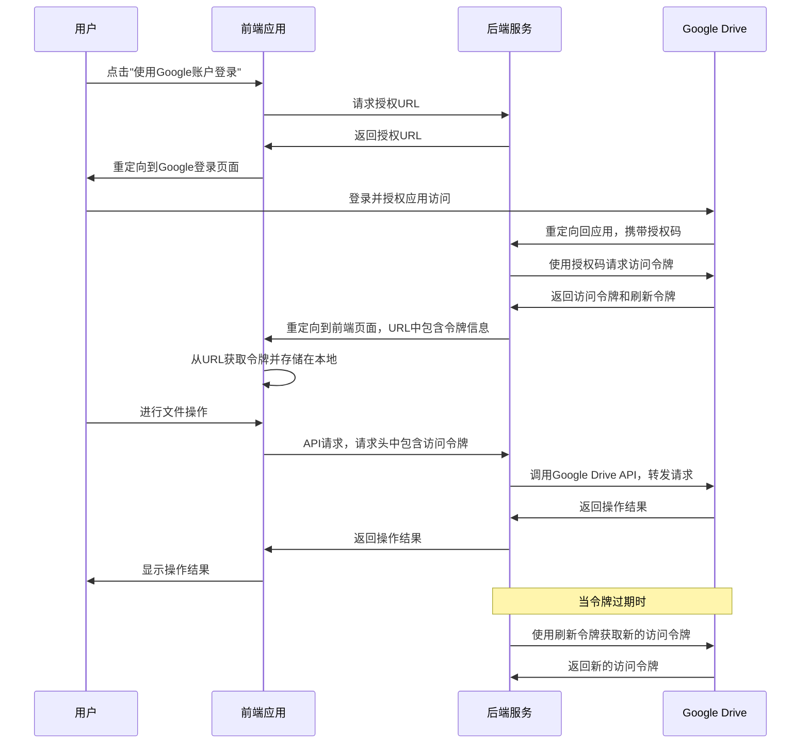

```mermaid
sequenceDiagram
    participant 用户
    participant 前端 as 前端应用
    participant 后端 as 后端服务
    participant GD as Google Drive

    用户->>前端: 点击"使用Google账户登录"
    前端->>后端: 请求授权URL
    后端->>前端: 返回授权URL
    前端->>用户: 重定向到Google登录页面
    用户->>GD: 登录并授权应用访问
    GD->>后端: 重定向回应用，携带授权码
    后端->>GD: 使用授权码请求访问令牌
    GD->>后端: 返回访问令牌和刷新令牌
    后端->>前端: 重定向到前端页面，URL中包含令牌信息
    前端->>前端: 从URL获取令牌并存储在本地
    用户->>前端: 进行文件操作
    前端->>后端: API请求，请求头中包含访问令牌
    后端->>GD: 调用Google Drive API，转发请求
    GD->>后端: 返回操作结果
    后端->>前端: 返回操作结果
    前端->>用户: 显示操作结果

    Note over 后端,GD: 当令牌过期时
    后端->>GD: 使用刷新令牌获取新的访问令牌
    GD->>后端: 返回新的访问令牌
```