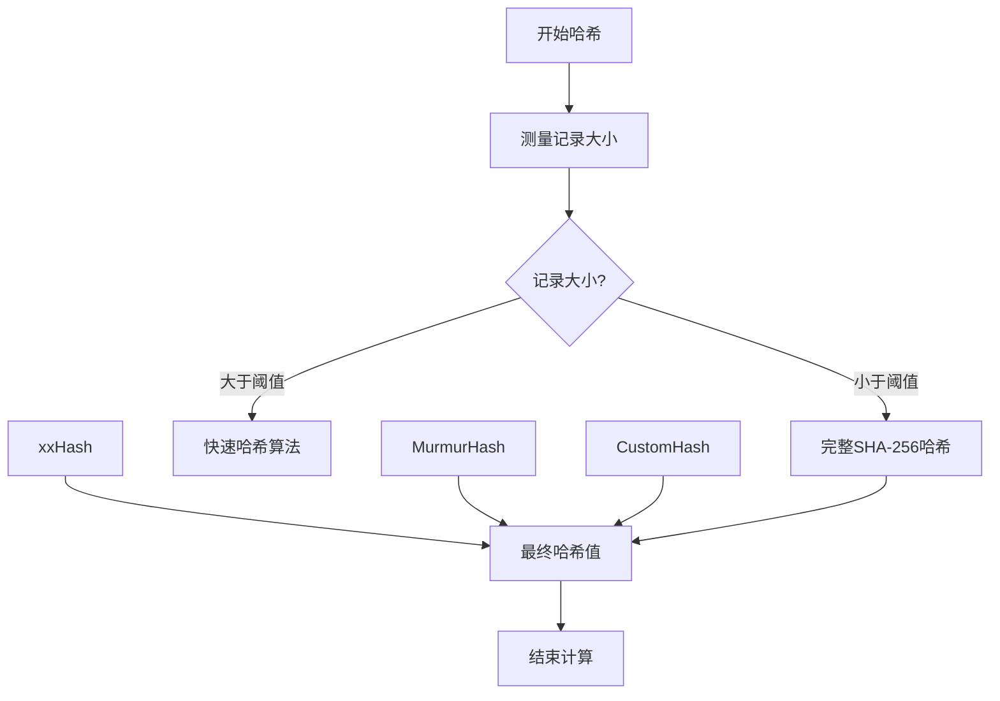

```mermaid
flowchart TD
    Start[开始哈希] --> MeasureSize[测量记录大小]
    MeasureSize --> SizeCheck{记录大小?}
    SizeCheck -- 小于阈值 --> FullHash[完整SHA-256哈希]
    SizeCheck -- 大于阈值 --> FastHash[快速哈希算法]
    
    xxHash --> FinalHash[最终哈希值]
    MurmurHash --> FinalHash
    CustomHash --> FinalHash
    FullHash --> FinalHash
    
    FinalHash --> End[结束计算]
```