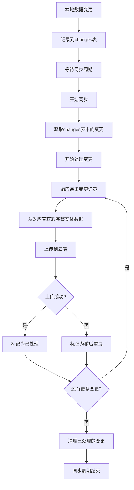

```mermaid
flowchart TD
    Start[本地数据变更] --> RecordChange[记录到changes表]
    RecordChange --> WaitSync[等待同步周期]
    WaitSync --> SyncStart[开始同步]
    SyncStart --> FetchChanges[获取changes表中的变更]
    FetchChanges --> BeginSync[开始处理变更]
    BeginSync --> ForEachChange[遍历每条变更记录]
    ForEachChange --> FetchEntity[从对应表获取完整实体数据]
    FetchEntity --> UploadToCloud[上传到云端]
    UploadToCloud --> UploadSuccess{上传成功?}
    UploadSuccess -- 是 --> MarkProcessed[标记为已处理]
    UploadSuccess -- 否 --> RetryLater[标记为稍后重试]
    MarkProcessed --> NextChange{还有更多变更?}
    RetryLater --> NextChange
    NextChange -- 是 --> ForEachChange
    NextChange -- 否 --> CleanupProcessed[清理已处理的变更]
    CleanupProcessed --> End[同步周期结束]
```