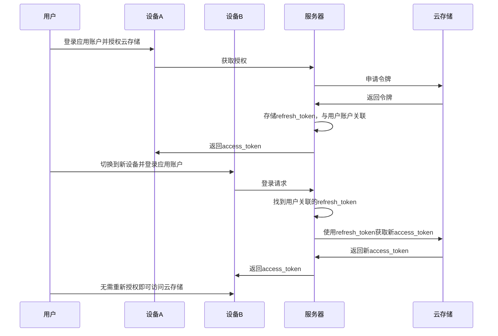

```mermaid
sequenceDiagram
    participant 用户
    participant 设备A
    participant 设备B
    participant 服务器
    participant 云存储
    
    用户->>设备A: 登录应用账户并授权云存储
    设备A->>服务器: 获取授权
    服务器->>云存储: 申请令牌
    云存储->>服务器: 返回令牌
    服务器->>服务器: 存储refresh_token，与用户账户关联
    服务器->>设备A: 返回access_token
    
    用户->>设备B: 切换到新设备并登录应用账户
    设备B->>服务器: 登录请求
    服务器->>服务器: 找到用户关联的refresh_token
    服务器->>云存储: 使用refresh_token获取新access_token
    云存储->>服务器: 返回新access_token
    服务器->>设备B: 返回access_token
    用户->>设备B: 无需重新授权即可访问云存储
```