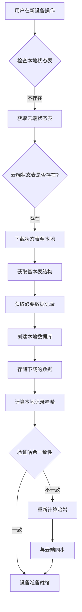

```mermaid
flowchart TD
    Start[用户在新设备操作] --> CheckLocalState{检查本地状态表}
    CheckLocalState -- 不存在 --> FetchCloudState[获取云端状态表]
    
    FetchCloudState --> TableExistsCheck{云端状态表是否存在?}
    TableExistsCheck -- 存在 --> DownloadState[下载状态表至本地]
    
    DownloadState --> FetchInitialTables[获取基本表结构]
    FetchInitialTables --> FetchNeededRecords[获取必要数据记录]
    
    FetchNeededRecords --> CreateLocalDB[创建本地数据库]
    CreateLocalDB --> StoreDownloadedData[存储下载的数据]
    
    StoreDownloadedData --> ComputeLocalHashes[计算本地记录哈希]
    ComputeLocalHashes --> VerifyConsistency{验证哈希一致性}
    
    VerifyConsistency -- 一致 --> ReadyToUse[设备准备就绪]
    VerifyConsistency -- 不一致 --> RecomputeHashes[重新计算哈希]
    RecomputeHashes --> SyncWithCloud[与云端同步]
    
    SyncWithCloud --> ReadyToUse
```