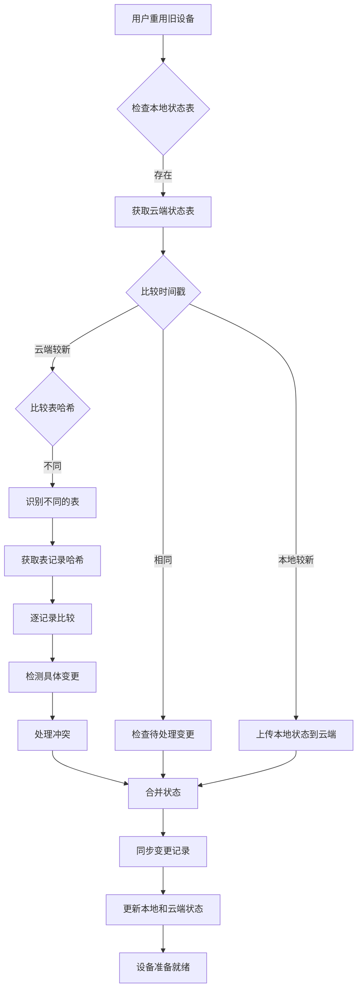

```mermaid
flowchart TD
    Start[用户重用旧设备] --> CheckLocalState{检查本地状态表}
    CheckLocalState -- 存在 --> FetchCloudState[获取云端状态表]
    
    FetchCloudState --> CompareTimestamps{比较时间戳}
    CompareTimestamps -- 云端较新 --> CompareTableHashes{比较表哈希}
    CompareTimestamps -- 本地较新 --> UploadState[上传本地状态到云端]
    CompareTimestamps -- 相同 --> CheckPendingChanges[检查待处理变更]
    
    CompareTableHashes -- 不同 --> IdentifyDifferentTables[识别不同的表]
    IdentifyDifferentTables --> FetchTableRecords[获取表记录哈希]
    FetchTableRecords --> CompareRecordWise[逐记录比较]
    
    CompareRecordWise --> DetectChanges[检测具体变更]
    DetectChanges --> HandleConflicts[处理冲突]
    
    HandleConflicts --> MergeStates[合并状态]
    CheckPendingChanges --> MergeStates
    UploadState --> MergeStates
    
    MergeStates --> SyncRecords[同步变更记录]
    SyncRecords --> UpdateBothStates[更新本地和云端状态]
    UpdateBothStates --> ReadyToUse[设备准备就绪]
```