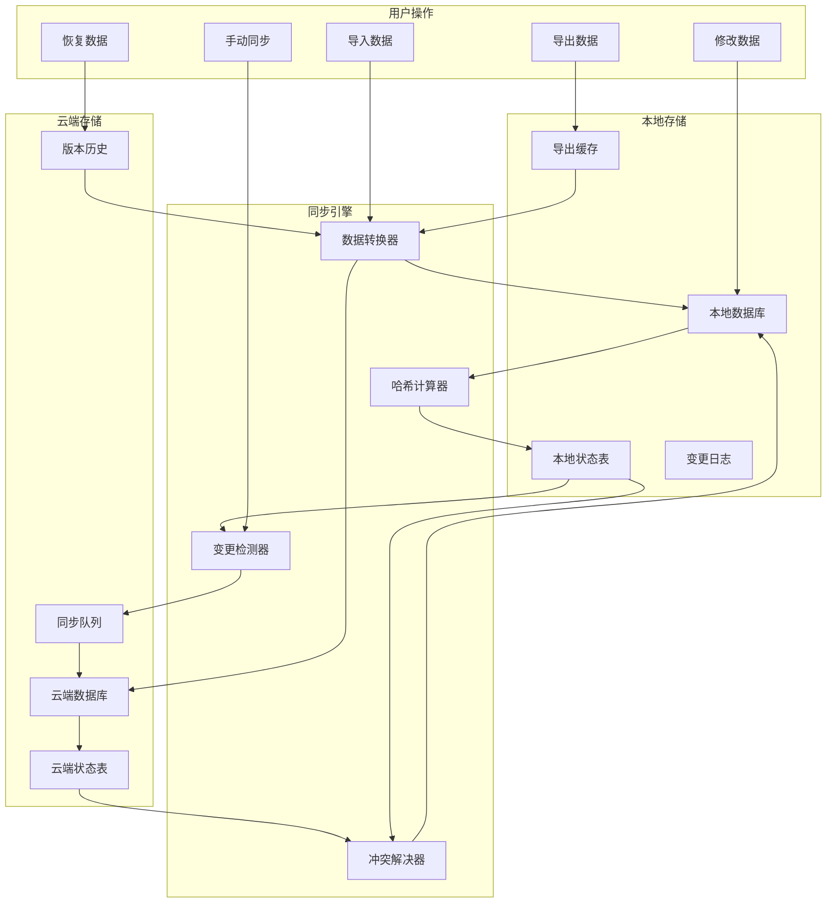

```mermaid
flowchart TD
    subgraph 本地存储
        LocalDB[本地数据库]
        LocalState[本地状态表]
        ChangeLog[变更日志]
        ExportCache[导出缓存]
    end
    
    subgraph 云端存储
        CloudDB[云端数据库]
        CloudState[云端状态表]
        SyncQueue[同步队列]
        VersionHistory[版本历史]
    end
    
    subgraph 同步引擎
        HashCalculator[哈希计算器]
        ChangesDetector[变更检测器]
        ConflictResolver[冲突解决器]
        DataTransformer[数据转换器]
    end
    
    subgraph 用户操作
        Modify[修改数据]
        Export[导出数据]
        Import[导入数据]
        SyncCommand[手动同步]
        Restore[恢复数据]
    end
    
    Modify --> LocalDB
    LocalDB --> HashCalculator
    HashCalculator --> LocalState
    LocalState --> ChangesDetector
    
    ChangesDetector --> SyncQueue
    SyncQueue --> CloudDB
    CloudDB --> CloudState
    
    Export --> ExportCache
    ExportCache --> DataTransformer
    Import --> DataTransformer
    DataTransformer --> LocalDB
    DataTransformer --> CloudDB
    
    SyncCommand --> ChangesDetector
    CloudState --> ConflictResolver
    LocalState --> ConflictResolver
    ConflictResolver --> LocalDB
    
    Restore --> VersionHistory
    VersionHistory --> DataTransformer
```