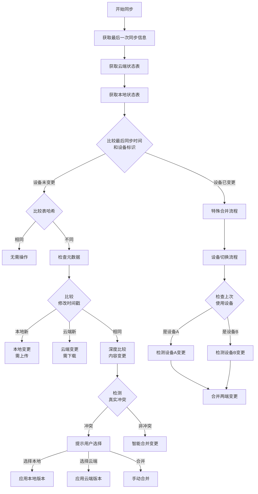

```mermaid
flowchart TD
    Start[开始同步] --> FetchLastSync[获取最后一次同步信息]
    FetchLastSync --> GetCloudState[获取云端状态表]
    GetCloudState --> GetLocalState[获取本地状态表]
    
    GetLocalState --> CompareLastSync{比较最后同步时间\n和设备标识}
    
    CompareLastSync -- 设备未变更 --> CompareTables{比较表哈希}
    CompareLastSync -- 设备已变更 --> SpecialMerge[特殊合并流程]
    
    CompareTables -- 相同 --> NoAction[无需操作]
    CompareTables -- 不同 --> CheckMetadata[检查元数据]
    
    CheckMetadata --> CompareTimestamps{比较\n修改时间戳}
    CompareTimestamps -- 本地新 --> LocalChange[本地变更\n需上传]
    CompareTimestamps -- 云端新 --> CloudChange[云端变更\n需下载]
    CompareTimestamps -- 相同 --> DeepCompare[深度比较\n内容变更]
    
    DeepCompare --> DetectConflict{检测\n真实冲突}
    DetectConflict -- 冲突 --> UserPrompt[提示用户选择]
    DetectConflict -- 非冲突 --> SmartMerge[智能合并变更]
    
    SpecialMerge --> DeviceSwitchFlow[设备切换流程]
    DeviceSwitchFlow --> CheckLastDevice{检查上次\n使用设备}
    
    CheckLastDevice -- 是设备A --> DetectAChanges[检测设备A变更]
    CheckLastDevice -- 是设备B --> DetectBChanges[检测设备B变更]
    
    DetectAChanges --> MergeBothChanges[合并两端变更]
    DetectBChanges --> MergeBothChanges
    
    UserPrompt -- 选择本地 --> ApplyLocal[应用本地版本]
    UserPrompt -- 选择云端 --> ApplyCloud[应用云端版本]
    UserPrompt -- 合并 --> MergeManually[手动合并]
```