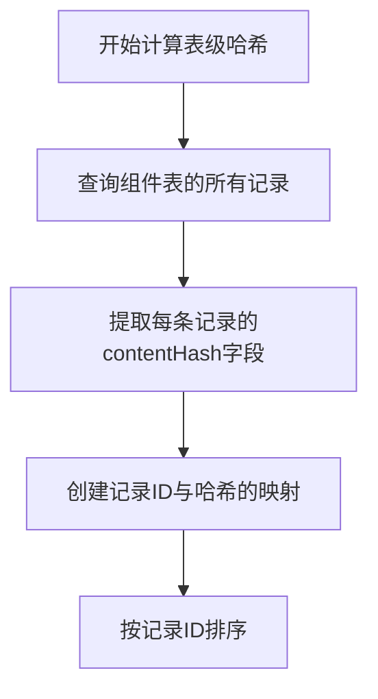

```mermaid
flowchart TD
    Start[开始计算表级哈希] --> QueryRecords[查询组件表的所有记录]
    QueryRecords --> ExtractHashes[提取每条记录的contentHash字段]
    ExtractHashes --> CreateHashMap[创建记录ID与哈希的映射]
    CreateHashMap --> SortByIds[按记录ID排序]

    
    
    
```