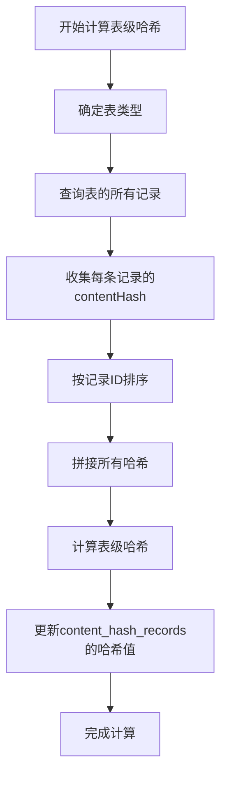

```mermaid
flowchart TD
    Start[开始计算表级哈希] --> GetTableType[确定表类型]
    GetTableType --> QueryRecords[查询表的所有记录]
    QueryRecords --> CollectHashes[收集每条记录的contentHash]
    
    CollectHashes --> SortByIds[按记录ID排序]
    SortByIds --> ConcatHashes[拼接所有哈希]
    ConcatHashes --> ComputeTableHash[计算表级哈希]
    
    ComputeTableHash --> UpdateStateTable[更新content_hash_records的哈希值]
    UpdateStateTable --> End[完成计算]
```