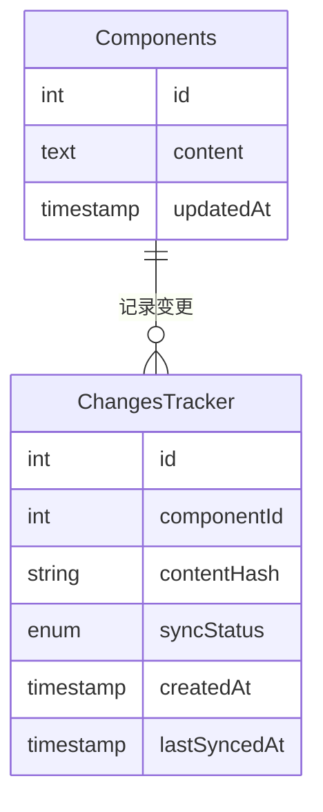

```mermaid
erDiagram
    Components ||--o{ ChangesTracker : "记录变更"
    
    Components {
        int id
        text content
        timestamp updatedAt
    }
    
    ChangesTracker {
        int id
        int componentId
        string contentHash
        enum syncStatus
        timestamp createdAt
        timestamp lastSyncedAt
    }
```