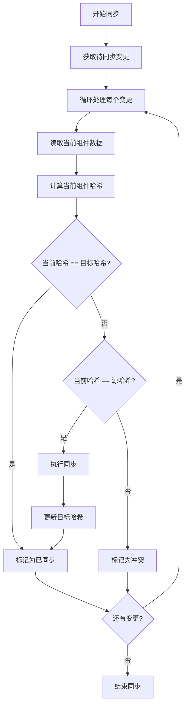

```mermaid
flowchart TD
    Start[开始同步] --> FetchChanges[获取待同步变更]
    FetchChanges --> Loop[循环处理每个变更]
    
    Loop --> ReadCurrent[读取当前组件数据]
    ReadCurrent --> ComputeCurrentHash[计算当前组件哈希]
    
    ComputeCurrentHash --> CheckHash{当前哈希 == 目标哈希?}
    
    CheckHash -->|是| MarkSynced[标记为已同步]
    CheckHash -->|否| CheckSourceHash{当前哈希 == 源哈希?}
    
    CheckSourceHash -->|是| PerformSync[执行同步]
    CheckSourceHash -->|否| MarkConflict[标记为冲突]
    
    PerformSync --> UpdateHash[更新目标哈希]
    UpdateHash --> MarkSynced
    
    MarkSynced --> NextChange{还有变更?}
    MarkConflict --> NextChange
    
    NextChange -->|是| Loop
    NextChange -->|否| End[结束同步]
```