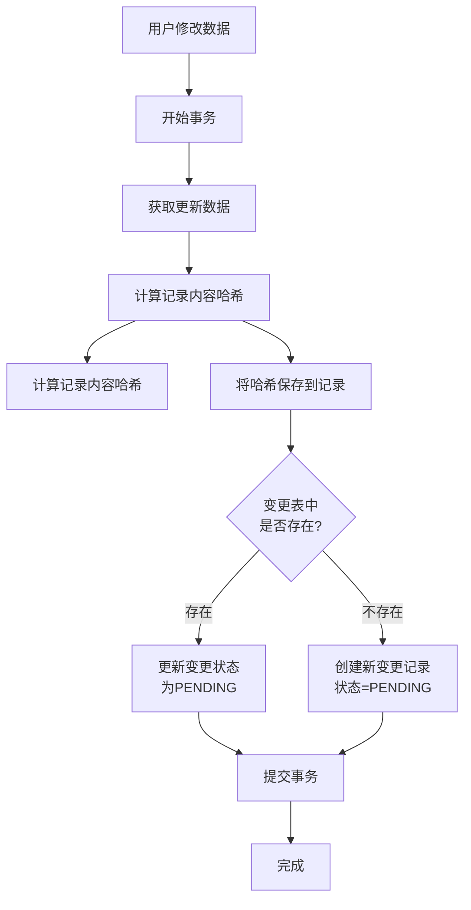

```mermaid
flowchart TD
    Start[用户修改数据] --> StartTransaction[开始事务]
    StartTransaction --> UpdateRecord[获取更新数据]
    UpdateRecord --> ComputeHash[计算记录内容哈希]
    ComputeHash --> 将[计算记录内容哈希]
    ComputeHash --> SaveHash[将哈希保存到记录]
    
    SaveHash --> CheckChangeExists{变更表中\n是否存在?}
    CheckChangeExists -- 存在 --> UpdateChange[更新变更状态\n为PENDING]
    CheckChangeExists -- 不存在 --> CreateChange[创建新变更记录\n状态=PENDING]
    
    UpdateChange --> CommitTransaction[提交事务]
    CreateChange --> CommitTransaction
    CommitTransaction --> End[完成]
```