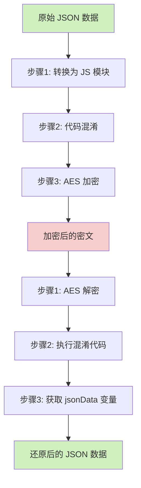

```mermaid
graph TD
    A[原始 JSON 数据] --> B[步骤1: 转换为 JS 模块]
    B --> C[步骤2: 代码混淆]
    C --> D[步骤3: AES 加密]
    D --> E[加密后的密文]
    
    E --> F[步骤1: AES 解密]
    F --> G[步骤2: 执行混淆代码]
    G --> H[步骤3: 获取 jsonData 变量]
    H --> I[还原后的 JSON 数据]
    
    style A fill:#d0f0c0
    style E fill:#f8cecc
    style I fill:#d0f0c0
```