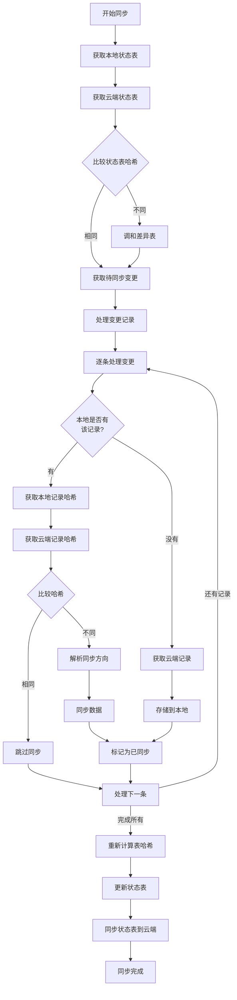

```mermaid
flowchart TD
    Start[开始同步] --> FetchLocalState[获取本地状态表]
    FetchLocalState --> FetchCloudState[获取云端状态表]
    
    FetchCloudState --> CompareStates{比较状态表哈希}
    CompareStates -- 相同 --> FetchChanges[获取待同步变更]
    CompareStates -- 不同 --> ReconcileTables[调和差异表]
    
    ReconcileTables --> FetchChanges
    FetchChanges --> ProcessChanges[处理变更记录]
    
    ProcessChanges --> RecordByRecord[逐条处理变更]
    RecordByRecord --> CheckLocalRecord{本地是否有\n该记录?}
    
    CheckLocalRecord -- 有 --> GetLocalHash[获取本地记录哈希]
    CheckLocalRecord -- 没有 --> FetchCloudRecord[获取云端记录]
    
    GetLocalHash --> FetchCloudHash[获取云端记录哈希]
    FetchCloudHash --> CompareHash{比较哈希}
    
    CompareHash -- 相同 --> SkipSync[跳过同步]
    CompareHash -- 不同 --> ResolveSync[解析同步方向]
    
    FetchCloudRecord --> StoreLocalRecord[存储到本地]
    ResolveSync --> SyncData[同步数据]
    
    StoreLocalRecord --> MarkSynced[标记为已同步]
    SyncData --> MarkSynced
    SkipSync --> NextRecord[处理下一条]
    
    MarkSynced --> NextRecord
    NextRecord -- 还有记录 --> RecordByRecord
    NextRecord -- 完成所有 --> RecalcTableHashes[重新计算表哈希]
    
    RecalcTableHashes --> UpdateStateTable[更新状态表]
    UpdateStateTable --> SyncStateTable[同步状态表到云端]
    SyncStateTable --> End[同步完成]
```