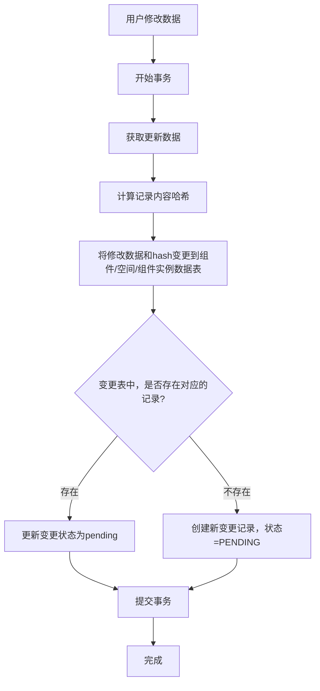

```mermaid
flowchart TD
    Start[用户修改数据] --> StartTransaction[开始事务]
    StartTransaction --> UpdateRecord[获取更新数据]
    UpdateRecord --> ComputeHash[计算记录内容哈希]
    ComputeHash --> SaveHash[将修改数据和hash变更到组件/空间/组件实例数据表]
   
    
    SaveHash --> CheckChangeExists{变更表中，是否存在对应的记录?}
    CheckChangeExists -- 存在 --> UpdateChange[更新变更状态为pending]
    CheckChangeExists -- 不存在 --> CreateChange[创建新变更记录，状态=PENDING]
    
    UpdateChange --> CommitTransaction[提交事务]
    CreateChange --> CommitTransaction
    CommitTransaction --> End[完成]
```