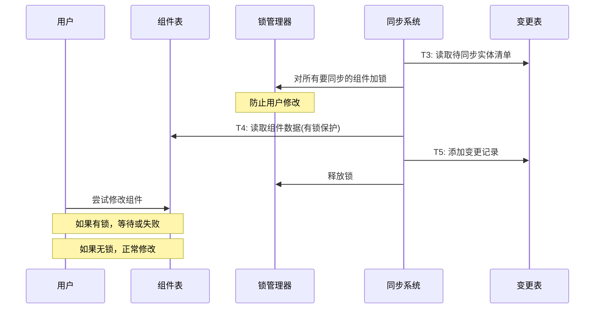

```mermaid
sequenceDiagram
    participant 用户
    participant 组件表
    participant 锁管理器
    participant 同步系统
    participant 变更表
    
    同步系统->>变更表: T3: 读取待同步实体清单
    同步系统->>锁管理器: 对所有要同步的组件加锁
    Note over 锁管理器: 防止用户修改
    
    同步系统->>组件表: T4: 读取组件数据(有锁保护)
    同步系统->>变更表: T5: 添加变更记录
    同步系统->>锁管理器: 释放锁
    
    用户->>组件表: 尝试修改组件
    Note over 用户,组件表: 如果有锁，等待或失败
    Note over 用户,组件表: 如果无锁，正常修改
```