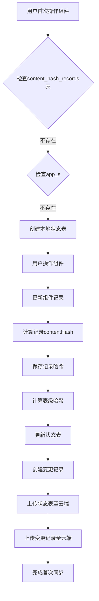

```mermaid
flowchart TD
    Start[用户首次操作组件] --> CheckLocalState{检查content_hash_records表}
    CheckLocalState -- 不存在 --> CheckCloudState{检查app_s}
    
    CheckCloudState -- 不存在 --> CreateLocalState[创建本地状态表]
    CreateLocalState --> FirstOperation[用户操作组件]
    
    FirstOperation --> UpdateRecord[更新组件记录]
    UpdateRecord --> CalculateHash[计算记录contentHash]
    CalculateHash --> SaveRecordHash[保存记录哈希]
    
    SaveRecordHash --> CalculateTableHash[计算表级哈希]
    CalculateTableHash --> UpdateStateTable[更新状态表]
    
    UpdateStateTable --> CreateChange[创建变更记录]
    CreateChange --> UploadState[上传状态表至云端]
    UploadState --> UploadChanges[上传变更记录至云端]
    
    UploadChanges --> CompleteFirstSync[完成首次同步]
```