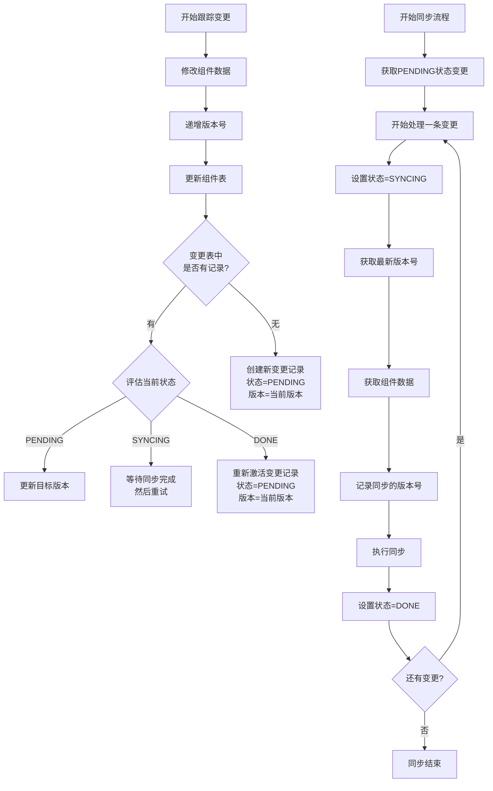

```mermaid
flowchart TD
    Start[开始跟踪变更] --> ChangeComponent[修改组件数据]
    ChangeComponent --> IncVersion[递增版本号]
    IncVersion --> UpdateComponent[更新组件表]
    
    UpdateComponent --> CheckChangeTable{变更表中<br/>是否有记录?}
    CheckChangeTable -- 有 --> EvaluateState{评估当前状态}
    CheckChangeTable -- 无 --> CreateNewRecord[创建新变更记录<br/>状态=PENDING<br/>版本=当前版本]
    
    EvaluateState -- PENDING --> UpdateVersion[更新目标版本]
    EvaluateState -- SYNCING --> WaitAndRetry[等待同步完成<br/>然后重试]
    EvaluateState -- DONE --> ReactivateChange[重新激活变更记录<br/>状态=PENDING<br/>版本=当前版本]
    
    SyncProcess[开始同步流程] --> FetchPending[获取PENDING状态变更]
    FetchPending --> BeginSync[开始处理一条变更]
    
    BeginSync --> SetSyncing[设置状态=SYNCING]
    SetSyncing --> GetLatestVersion[获取最新版本号]
    GetLatestVersion --> FetchData[获取组件数据]
    
    FetchData --> RecordSyncVersion[记录同步的版本号]
    RecordSyncVersion --> PerformSync[执行同步]
    PerformSync --> SetDone[设置状态=DONE]
    
    SetDone --> NextChange{还有变更?}
    NextChange -- 是 --> BeginSync
    NextChange -- 否 --> EndSync[同步结束]
```