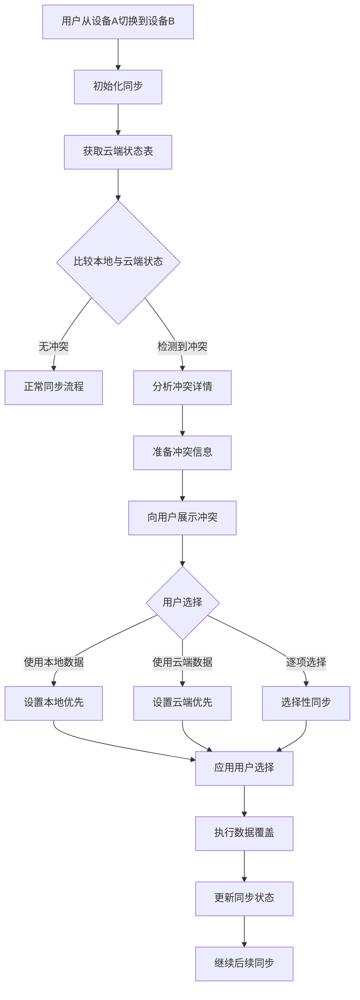

```mermaid
flowchart TD
    Start[用户从设备A切换到设备B] --> InitSync[初始化同步]
    InitSync --> FetchCloudState[获取云端状态表]
    FetchCloudState --> CompareState{比较本地与云端状态}
    
    CompareState -- 无冲突 --> NormalSync[正常同步流程]
    CompareState -- 检测到冲突 --> AnalyzeConflict[分析冲突详情]
    
    AnalyzeConflict --> PrepareConflictInfo[准备冲突信息]
    PrepareConflictInfo --> UserPrompt[向用户展示冲突]
    
    UserPrompt --> UserDecision{用户选择}
    UserDecision -- 使用本地数据 --> LocalPriority[设置本地优先]
    UserDecision -- 使用云端数据 --> CloudPriority[设置云端优先]
    UserDecision -- 逐项选择 --> SelectiveSync[选择性同步]
    
    LocalPriority --> ApplyStrategy[应用用户选择]
    CloudPriority --> ApplyStrategy
    SelectiveSync --> ApplyStrategy
    
    ApplyStrategy --> PerformSync[执行数据覆盖]
    PerformSync --> UpdateStatus[更新同步状态]
    UpdateStatus --> ContinueSync[继续后续同步]
```