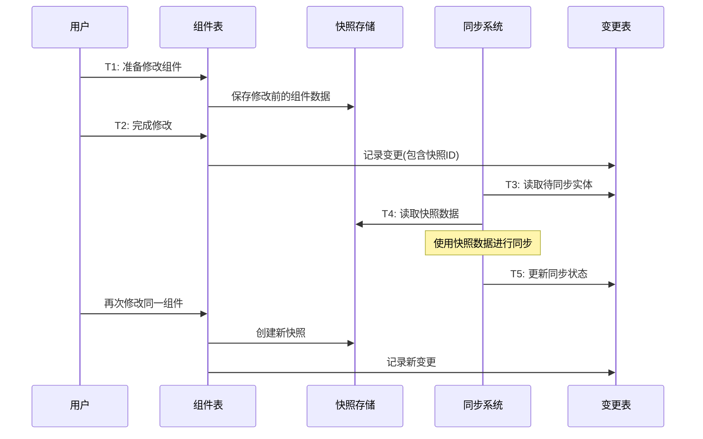

```mermaid
sequenceDiagram
    participant 用户
    participant 组件表
    participant 快照存储
    participant 同步系统
    participant 变更表
    
    用户->>组件表: T1: 准备修改组件
    组件表->>快照存储: 保存修改前的组件数据
    用户->>组件表: T2: 完成修改
    组件表->>变更表: 记录变更(包含快照ID)
    
    同步系统->>变更表: T3: 读取待同步实体
    同步系统->>快照存储: T4: 读取快照数据
    Note over 同步系统: 使用快照数据进行同步
    同步系统->>变更表: T5: 更新同步状态
    
    用户->>组件表: 再次修改同一组件
    组件表->>快照存储: 创建新快照
    组件表->>变更表: 记录新变更
```