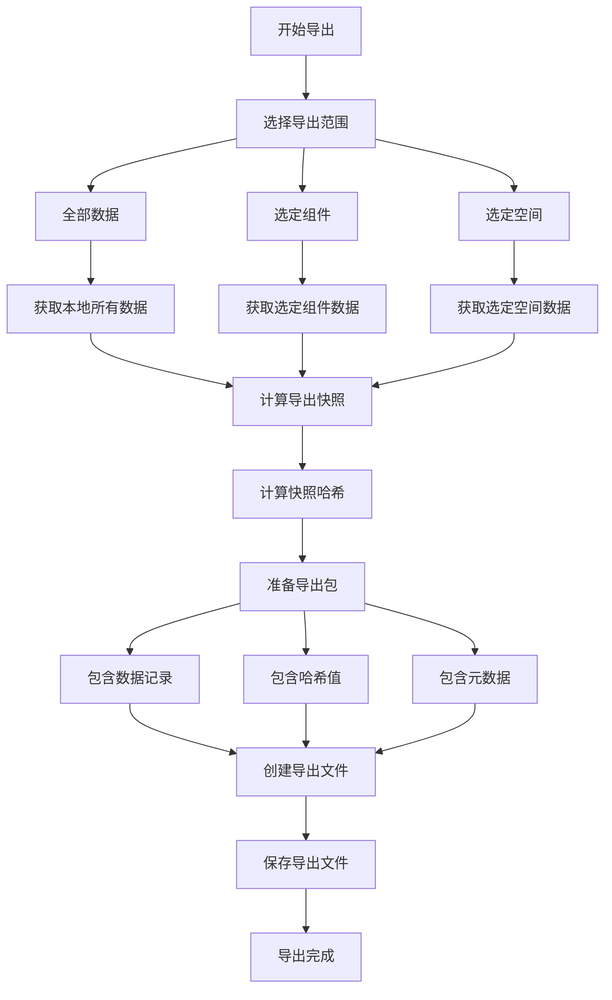

```mermaid
flowchart TD
    Start[开始导出] --> SelectScope[选择导出范围]
    SelectScope --> AllData[全部数据]
    SelectScope --> SelectedComponents[选定组件]
    SelectScope --> SelectedSpaces[选定空间]
    
    AllData --> FetchLocal[获取本地所有数据]
    SelectedComponents --> FetchComponents[获取选定组件数据]
    SelectedSpaces --> FetchSpaces[获取选定空间数据]
    
    FetchLocal --> ComputeSnapshot[计算导出快照]
    FetchComponents --> ComputeSnapshot
    FetchSpaces --> ComputeSnapshot
    
    ComputeSnapshot --> CalcSnapshotHash[计算快照哈希]
    CalcSnapshotHash --> PrepareExportPackage[准备导出包]
    
    PrepareExportPackage --> IncludeData[包含数据记录]
    PrepareExportPackage --> IncludeHashes[包含哈希值]
    PrepareExportPackage --> IncludeMetadata[包含元数据]
    
    IncludeData --> CreateExportFile[创建导出文件]
    IncludeHashes --> CreateExportFile
    IncludeMetadata --> CreateExportFile
    
    CreateExportFile --> SaveExport[保存导出文件]
    SaveExport --> End[导出完成]
```