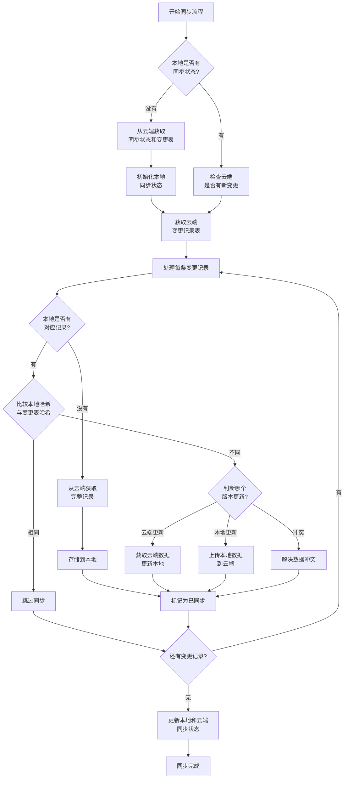

```mermaid
flowchart TD
    Start[开始同步流程] --> CheckLocal{本地是否有\n同步状态?}
    
    CheckLocal -- 没有 --> FetchCloud[从云端获取\n同步状态和变更表]
    CheckLocal -- 有 --> CheckCloudChanges[检查云端\n是否有新变更]
    
    FetchCloud --> InitLocal[初始化本地\n同步状态]
    InitLocal --> QueryChangeRecords[获取云端\n变更记录表]
    
    CheckCloudChanges --> QueryChangeRecords
    
    QueryChangeRecords --> ProcessChanges[处理每条变更记录]
    
    ProcessChanges --> CheckLocalRecord{本地是否有\n对应记录?}
    
    CheckLocalRecord -- 没有 --> FetchRecord[从云端获取\n完整记录]
    CheckLocalRecord -- 有 --> CompareHash{比较本地哈希\n与变更表哈希}
    
    FetchRecord --> StoreLocal[存储到本地]
    StoreLocal --> MarkSynced[标记为已同步]
    
    CompareHash -- 相同 --> SkipSync[跳过同步]
    CompareHash -- 不同 --> DetermineNewer{判断哪个\n版本更新?}
    
    DetermineNewer -- 云端更新 --> FetchAndUpdate[获取云端数据\n更新本地]
    DetermineNewer -- 本地更新 --> UploadToCloud[上传本地数据\n到云端]
    DetermineNewer -- 冲突 --> ResolveConflict[解决数据冲突]
    
    FetchAndUpdate --> MarkSynced
    UploadToCloud --> MarkSynced
    ResolveConflict --> MarkSynced
    
    SkipSync --> NextRecord{还有变更记录?}
    MarkSynced --> NextRecord
    
    NextRecord -- 有 --> ProcessChanges
    NextRecord -- 无 --> UpdateSyncState[更新本地和云端\n同步状态]
    UpdateSyncState --> End[同步完成]
```