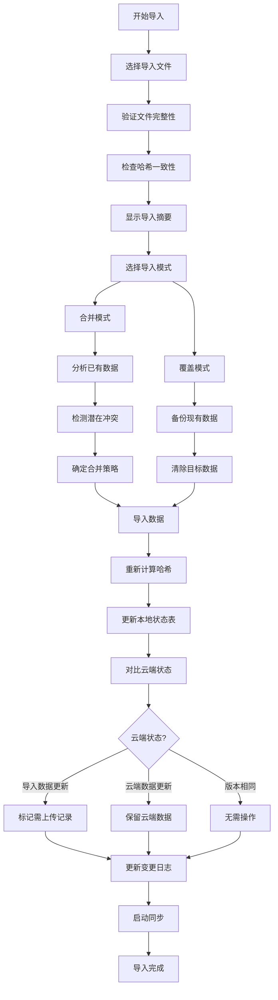

```mermaid
flowchart TD
    Start[开始导入] --> SelectImportFile[选择导入文件]
    SelectImportFile --> ValidateFile[验证文件完整性]
    
    ValidateFile --> CheckHashConsistency[检查哈希一致性]
    CheckHashConsistency --> DisplaySummary[显示导入摘要]
    
    DisplaySummary --> SelectImportMode[选择导入模式]
    SelectImportMode --> MergeMode[合并模式]
    SelectImportMode --> OverwriteMode[覆盖模式]
    
    MergeMode --> AnalyzeExisting[分析已有数据]
    AnalyzeExisting --> DetectConflicts[检测潜在冲突]
    DetectConflicts --> ResolveMergeStrategy[确定合并策略]
    
    OverwriteMode --> BackupExisting[备份现有数据]
    BackupExisting --> ClearTargetData[清除目标数据]
    
    ResolveMergeStrategy --> ImportData[导入数据]
    ClearTargetData --> ImportData
    
    ImportData --> RecalculateHashes[重新计算哈希]
    RecalculateHashes --> UpdateLocalState[更新本地状态表]
    
    UpdateLocalState --> DetectCloudChanges[对比云端状态]
    DetectCloudChanges --> CloudStateCheck{云端状态?}
    
    CloudStateCheck -- 导入数据更新 --> MarkForUpload[标记需上传记录]
    CloudStateCheck -- 云端数据更新 --> KeepCloudData[保留云端数据]
    CloudStateCheck -- 版本相同 --> NoAction[无需操作]
    
    MarkForUpload --> UpdateChangeLog[更新变更日志]
    KeepCloudData --> UpdateChangeLog
    NoAction --> UpdateChangeLog
    
    UpdateChangeLog --> InitiateSync[启动同步]
    InitiateSync --> End[导入完成]
```