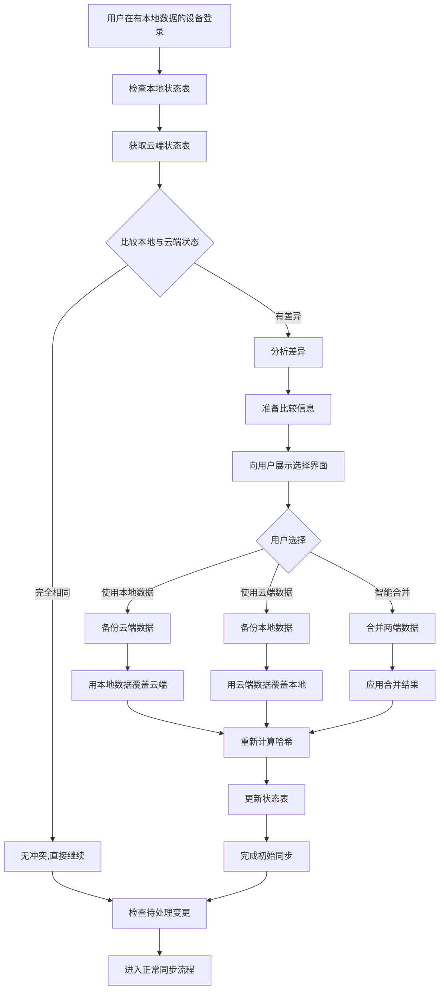

```mermaid
flowchart TD
    Start[用户在有本地数据的设备登录] --> CheckLocalState[检查本地状态表]
    CheckLocalState --> FetchCloudState[获取云端状态表]
    
    FetchCloudState --> CompareStates{比较本地与云端状态}
    
    CompareStates -- 完全相同 --> NoConflict[无冲突,直接继续]
    CompareStates -- 有差异 --> AnalyzeDifferences[分析差异]
    
    AnalyzeDifferences --> PrepareComparison[准备比较信息]
    PrepareComparison --> UserPrompt[向用户展示选择界面]
    
    UserPrompt --> UserChoice{用户选择}
    UserChoice -- 使用本地数据 --> BackupCloud[备份云端数据]
    UserChoice -- 使用云端数据 --> BackupLocal[备份本地数据]
    UserChoice -- 智能合并 --> MergeData[合并两端数据]
    
    BackupCloud --> OverwriteCloud[用本地数据覆盖云端]
    BackupLocal --> OverwriteLocal[用云端数据覆盖本地]
    MergeData --> ApplyMerge[应用合并结果]
    
    OverwriteCloud --> RecalculateHashes[重新计算哈希]
    OverwriteLocal --> RecalculateHashes
    ApplyMerge --> RecalculateHashes
    
    RecalculateHashes --> UpdateStateTable[更新状态表]
    UpdateStateTable --> SyncComplete[完成初始同步]
    
    NoConflict --> CheckPendingChanges[检查待处理变更]
    SyncComplete --> CheckPendingChanges
    
    CheckPendingChanges --> NormalSync[进入正常同步流程]
```