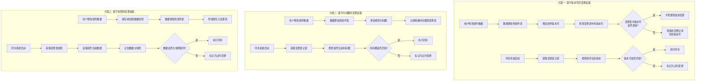

```mermaid
flowchart TD
    subgraph 方案一: 基于版本号的变更追踪
        A1[用户修改组件数据] --> B1[数据更新到组件表]
        B1 --> C1[增加组件版本号]
        C1 --> D1[检查变更表中的版本号]
        D1 --> E1{变更表中版本号\n是否最新?}
        E1 -->|是| F1[不需要添加新变更]
        E1 -->|否| G1[添加新变更记录\n带新版本号]
        
        H1[同步系统启动] --> I1[获取变更表记录]
        I1 --> J1[检查组件当前版本]
        J1 --> K1{版本号是否匹配?}
        K1 -->|是| L1[执行同步]
        K1 -->|否| M1[标记为过时变更]
    end
    
    subgraph 方案二: 基于时间戳的变更追踪
        A2[用户修改组件数据] --> B2[数据更新到组件表]
        B2 --> C2[更新修改时间戳]
        C2 --> D2[记录精确时间戳到变更表]
        
        E2[同步系统启动] --> F2[获取变更表记录]
        F2 --> G2[检查组件当前时间戳]
        G2 --> H2{时间戳是否匹配?}
        H2 -->|是| I2[执行同步]
        H2 -->|否| J2[标记为过时变更]
    end
    
    subgraph 方案三: 基于快照的变更追踪
        A3[用户修改组件数据] --> B3[保存前创建数据快照]
        B3 --> C3[数据更新到组件表]
        C3 --> D3[将快照存入变更表]
        
        E3[同步系统启动] --> F3[获取变更表快照]
        F3 --> G3[读取组件当前数据]
        G3 --> H3[比较数据与快照]
        H3 --> I3{数据是否与快照相同?}
        I3 -->|是| J3[执行同步]
        I3 -->|否| K3[标记为过时变更]
    end
```