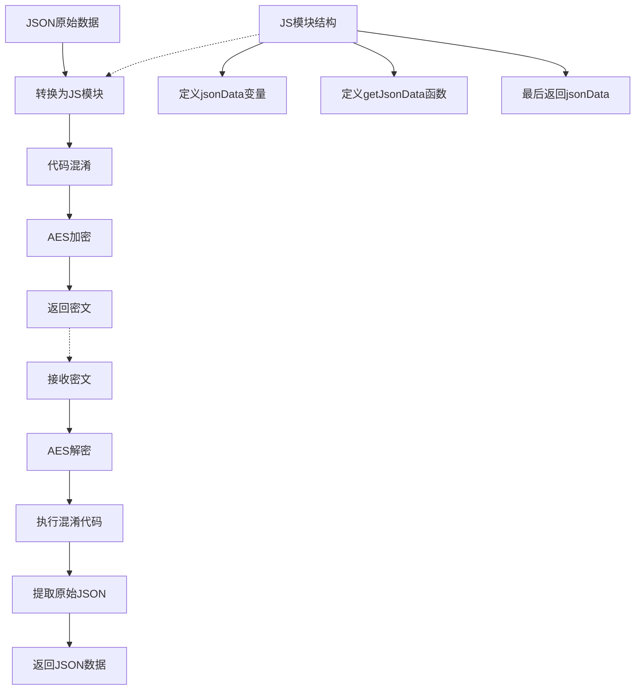

```mermaid
graph TD
    A[JSON原始数据] --> B[转换为JS模块]
    B --> C[代码混淆]
    C --> D[AES加密]
    D --> E[返回密文]
    
    F[接收密文] --> G[AES解密]
    G --> H[执行混淆代码]
    H --> I[提取原始JSON]
    I --> J[返回JSON数据]
    
    E -.-> F
    
    K[JS模块结构] -.-> B
    K --> K1[定义jsonData变量]
    K --> K2[定义getJsonData函数]
    K --> K3[最后返回jsonData]
```