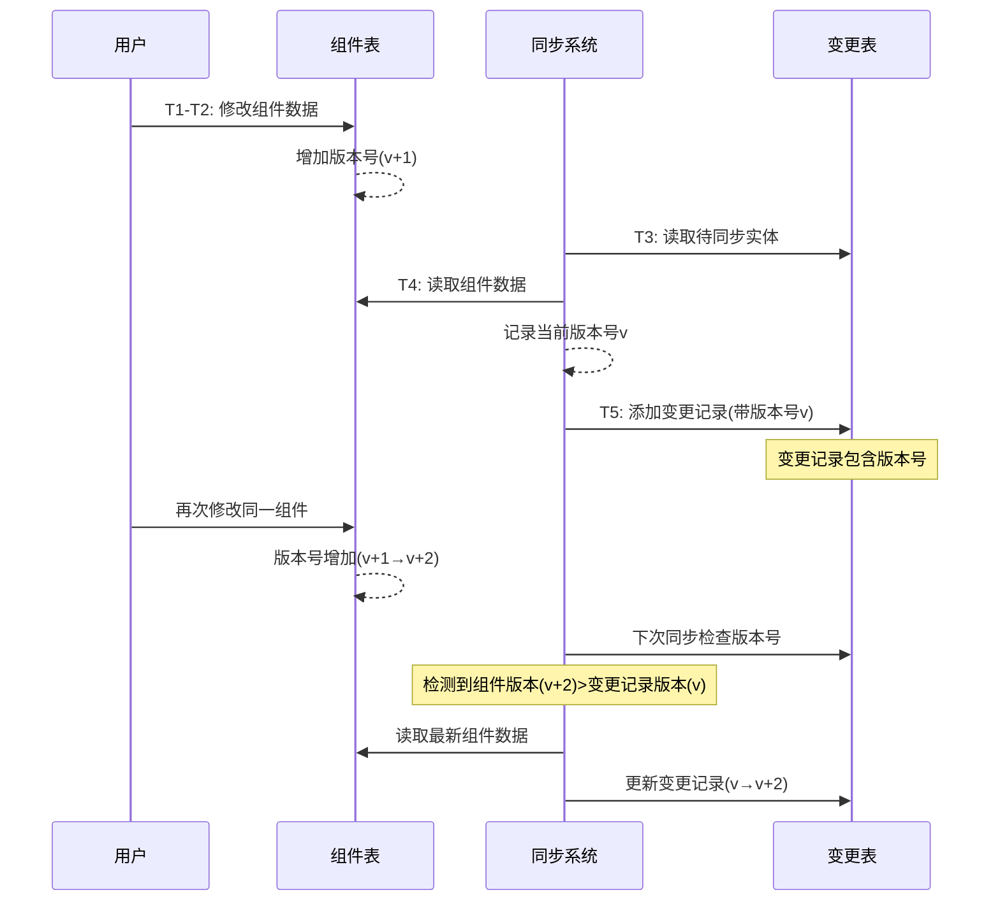

```mermaid
sequenceDiagram
    participant 用户
    participant 组件表
    participant 同步系统
    participant 变更表
    
    用户->>组件表: T1-T2: 修改组件数据
    组件表-->>组件表: 增加版本号(v+1)
    同步系统->>变更表: T3: 读取待同步实体
    同步系统->>组件表: T4: 读取组件数据
    同步系统-->>同步系统: 记录当前版本号v
    同步系统->>变更表: T5: 添加变更记录(带版本号v)
    Note over 变更表: 变更记录包含版本号
    
    用户->>组件表: 再次修改同一组件
    组件表-->>组件表: 版本号增加(v+1→v+2)
    
    同步系统->>变更表: 下次同步检查版本号
    Note over 同步系统: 检测到组件版本(v+2)>变更记录版本(v)
    同步系统->>组件表: 读取最新组件数据
    同步系统->>变更表: 更新变更记录(v→v+2)
```