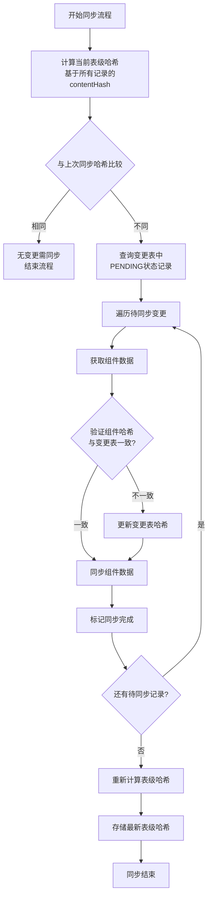

```mermaid
flowchart TD
    Start[开始同步流程] --> CalcTableHash[计算当前表级哈希\n基于所有记录的contentHash]
    
    CalcTableHash --> CompareLastSync{与上次同步哈希比较}
    CompareLastSync -- 相同 --> NoChanges[无变更需同步\n结束流程]
    CompareLastSync -- 不同 --> QueryPending[查询变更表中\nPENDING状态记录]
    
    QueryPending --> LoopChanges[遍历待同步变更]
    LoopChanges --> FetchComponent[获取组件数据]
    
    FetchComponent --> VerifyHash{验证组件哈希\n与变更表一致?}
    VerifyHash -- 一致 --> SyncData[同步组件数据]
    VerifyHash -- 不一致 --> UpdateChangeHash[更新变更表哈希]
    
    UpdateChangeHash --> SyncData
    SyncData --> MarkSynced[标记同步完成]
    
    MarkSynced --> NextChange{还有待同步记录?}
    NextChange -- 是 --> LoopChanges
    NextChange -- 否 --> RecalcTableHash[重新计算表级哈希]
    
    RecalcTableHash --> StoreTableHash[存储最新表级哈希]
    StoreTableHash --> End[同步结束]
```